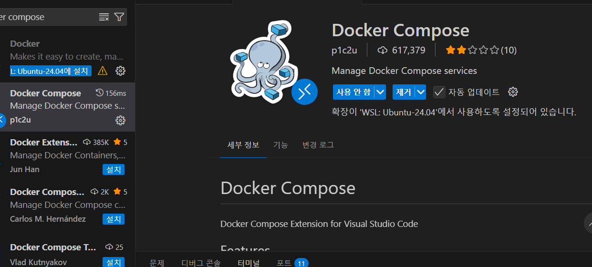

# 금융상품·생활거래 RAG 학습랩 및 퀀트 투자 분석

이 프로젝트는 금융상품과 자산배분 방법론을 학습하고 탐색하기 위한 프라이빗 특화 RAG(Retrieval-Augmented Generation) 서비스와 주가지수 및 개별 종목의 데이터를 바탕으로 퀀트 투자를 분석하는 대시보드를 통합한 플랫폼입니다.

> **"금융상품에 대한 깊이 있는 이해와, 백테스트를 통한 전략 검증의 통합"**


<!-- 🔴 화면 캡처 이미지가 들어갈 자리입니다. -->
<p align="center">
  
</p>

## 이 문서를 읽는 사람
| 당신이 | 여기부터 | 그다음 |
|---|---|---|
| **처음 보는 분** 이라면 | [프로젝트 한눈에 보기](#프로젝트-한눈에-보기) → 대시보드 | [시스템 아키텍처](#시스템-아키텍처) |
| **운영자** 라면 | [빠른 시작과 배포](#빠른-시작과-배포) | [기술 스택](#기술-스택) |

## 목차
- [프로젝트 한눈에 보기](#프로젝트-한눈에-보기)
- [시스템 아키텍처](#시스템-아키텍처)
- [기능 명세](#기능-명세)
- [기술 스택](#기술-스택)
- [빠른 시작과 배포](#빠른-시작과-배포)
- [유의사항](#유의사항)

---

## 프로젝트 한눈에 보기

이 저장소는 두 가지 핵심 도메인을 하나로 묶었습니다.

1. **금융상품 특화 RAG 챗봇**: 예금, 펀드, 주식, 채권, 부동산, 중고거래 등 다양한 금융/생활거래 지식을 TXT, PDF 형태로 등록하고, 질문에 대한 근거 있는 답변을 제공합니다.
2. **퀀트 투자 및 백테스트 대시보드**: KOSPI200 및 개별 종목에 대한 분석, 기술적 지표 계산, 그리고 QuantConnect LEAN 엔진과 yfinance 데이터를 활용한 백테스트 결과를 시각화합니다.

이 저장소는 순수 Vanilla JS 기반의 강력한 SPA(Single Page Application) 프론트엔드와 FastAPI 기반의 백엔드를 통합하여, 단일 환경에서 두 가지 기능을 자연스럽게 이용할 수 있도록 구축되었습니다.

### 화면 미리보기

<table>
<tr>
<td width="50%"></td>
<td width="50%"></td>
</tr>
<tr>
<td><sub><b>메인 대시보드</b> — 퀀트 지표 및 투자 분석</sub></td>
<td><sub><b>RAG 챗봇</b> — 금융 문서 기반 질의응답</sub></td>
</tr>
</table>

---

## 시스템 아키텍처

프론트엔드는 `app.js` 단일 파일로 빌드된 SPA 아키텍처를 가지며, 백엔드는 FastAPI 로 REST API 를 제공합니다.

<p align="center">
  
</p>

### 디렉토리 구조
```text
.
├── app/                  # FastAPI 백엔드
│   ├── api/routes/       # chat, ingest, health, backtest, ml 등 API
│   ├── core/             # 환경 설정 및 DB 연결
│   ├── models/           # 데이터 모델
│   ├── services/         # RAG, 임베딩, DB 비즈니스 로직
│   └── main.py           # FastAPI 엔트리포인트
├── data/                 # 금융상품·자산배분 샘플 문서, 업로드 폴더
├── frontend/             # 순수 Vanilla JS SPA 프론트엔드
│   ├── app.js            # 전체 UI 라우팅 및 상태 관리 로직 
│   └── index.html        # 메인 진입점
├── streamlit_app.py      # Streamlit 데모 UI (포트 8290)
├── docker-compose.yml    # 전체 인프라 통합 컨테이너 오케스트레이션
└── requirements.txt      # 파이썬 의존성
```

---

## 기능 명세

### 1. RAG 기반 금융 지식 질의응답
- **문서 등록 (Ingestion)**: 텍스트 및 PDF 파일을 청킹(Chunking)하여 Qdrant 벡터 DB에 저장.
- **RAG 검색**: 사용자 질문에 대해 유사도가 높은 문서 조각을 검색하여 제공.
- **LLM 연동**: Ollama 또는 OpenAI 호환 API를 통해 검색된 문맥을 바탕으로 자연어 답변 생성.

### 2. 퀀트 투자 분석 및 시뮬레이션
- **백테스팅**: QuantConnect LEAN 컨테이너를 호출하여, 선택한 전략과 종목(yfinance 데이터 연동)에 대한 백테스트 수행.
- **포트폴리오 분석**: 샤프 지수, MDD, 연환산 수익률 등 주요 투자 지표 계산 및 차트 시각화.
- **마켓 대시보드**: 실시간 시세 및 거시 경제 지표 시각화.

---

## 기술 스택

| 영역 | 사용 기술 |
|---|---|
| **언어/런타임** | Python 3.11, Vanilla JavaScript |
| **백엔드 프레임워크** | FastAPI, Uvicorn |
| **프론트엔드** | HTML5, CSS3, Vanilla JS (SPA 아키텍처) |
| **데이터베이스** | PostgreSQL (pgvector), Qdrant (벡터 DB), Redis (캐시) |
| **인프라/배포** | Docker, Docker Compose, AWS EC2 |
| **퀀트/백테스트** | QuantConnect LEAN, yfinance |

---

## 빠른 시작과 배포

본 프로젝트는 Docker Compose를 통해 전체 스택(FastAPI, Qdrant, Redis, PostgreSQL, Streamlit)을 한 번에 띄울 수 있도록 구성되어 있습니다.

### 1. 환경 변수 설정
`.env` 파일을 프로젝트 루트에 생성하고 필요한 API 키와 DB 자격 증명을 설정합니다. (상세 내용은 관리자에게 문의)

### 2. 컨테이너 실행
```bash
docker-compose up -d --build
```

### 3. 접속
- **메인 통합 대시보드 (SPA)**: `http://localhost:80`
- **Streamlit 데모 UI**: `http://localhost:8290`
- **API 문서 (Swagger)**: `http://localhost:8000/docs`

---

## 유의사항

- **데이터 최신성**: 답변 품질은 등록 문서의 최신성·정확성에 직접 좌우됩니다. 자산배분 정책 및 금융 상품 설명서는 항상 최신 버전으로 유지하십시오.
- **투자 책임**: 본 애플리케이션은 실시간 시세·공시 변경을 자동 조회하지 않으며, 특정 투자자에게 적합한 상품이나 비중을 보증하지 않습니다. 투자의 최종 결정과 책임은 사용자 본인에게 있습니다.
