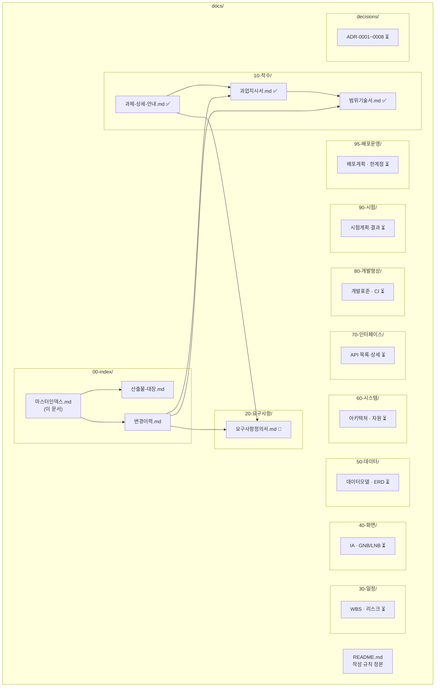

# 마스터인덱스

> - **버전**: v0.1
> - **최종 수정**: 2026-09-22 (KST)
> - **상태**: 초안
> - **기준 코드**: `main @ 1ba5a1c`
> - **역할**: 프로젝트의 **전체 지도**. 어디에 무엇이 있는지 한 곳에서 본다.
> - **관련**: [산출물-대장](산출물-대장.md) · [변경이력](변경이력.md) · [작성 규칙](../README.md)

---

## 0. 한 장 요약

| 항목 | 내용 |
| --- | --- |
| 과업명 | **investment-rag-lab** — 두 웹앱(domain-rag-lab + investment-analysis) 통합 금융 상식 시스템 |
| 과제 요건 | 10단원 재구성 · RAG 인덱싱 · GNB/LNB 재배치 · EC2 배포 ([과제-상세-안내.md](../10-착수/과제-상세-안내.md) A-1~A-6) |
| 원문 | [`test.md`](../../test.md) (목적) + [과제-상세-안내.md](../10-착수/과제-상세-안내.md) (방법·형태) |
| 저장소 | GitHub: `EST-Bootcamp-Dongwon/investment-rag-lab` · GitLab: `mygithub05253/investment-rag-lab` |
| 기준 코드 | `main @ 1ba5a1c` |
| 일정 | 이틀 (2026-09-22 ~ 09-23) |
| 범위 변경 | CN-001~CN-008 등록 ([변경이력](변경이력.md)). v0.1 문서들은 "용어사전 1개" 전제인데, 과제 상세에 의해 전면 통합으로 확대됨 |

---

## 1. 문서 지도

### 1.1 산출물 계층



### 1.2 상태 범례

| 기호 | 뜻 |
| --- | --- |
| ✅ | 완료 |
| 🔨 | 진행중 |
| ⏳ | 미착수 |
| 🚫 | N/A (해당없음) |

상세 현황은 [산출물-대장](산출물-대장.md) 참조.

---

## 2. 핵심 문서 바로가기

### 2.1 지금 읽어야 할 것

| 순서 | 문서 | 왜 먼저 읽는가 |
| --- | --- | --- |
| 1 | [과제-상세-안내.md](../10-착수/과제-상세-안내.md) | 과제 요건 원문(A-1~A-6)과 해석이 여기 있다 |
| 2 | [변경이력.md](변경이력.md) | CN-001~CN-008 이 기존 설계를 어떻게 바꾸는지 한눈에 본다 |
| 3 | [과업지시서.md](../10-착수/과업지시서.md) | 과업의 배경·목표·산출물·제약. **단, v0.1 은 "용어사전 1개" 전제임** |
| 4 | [범위기술서.md](../10-착수/범위기술서.md) | 포함/제외 판정과 인수 기준(AC-01~AC-10). **CN-001 에 의해 재정의 필요** |

### 2.2 과제 요건 ↔ 문서 매핑

| 요건 | 대응 문서 | 상태 |
| --- | --- | --- |
| A-1 통합 | 과업지시서 1.1절 · 범위기술서 5절 | ✅ (재정의 필요) |
| A-2 10단원 | 요구사항정의서 REQ-001 | 🔨 |
| A-3 RAG 인덱싱 | 요구사항정의서 REQ-002 | 🔨 |
| A-4 GNB/LNB | 요구사항정의서 REQ-004 · 40-화면/ | ⏳ |
| A-5 별도 저장소 | CN-002 | ✅ (이미 분리됨) |
| A-6 EC2 배포 | 요구사항정의서 REQ-005 · 95-배포운영/ | ⏳ |

---

## 3. 저장소 구조

```text
investment-rag-lab/           ← 통합 베이스 (domain-rag-lab 시드)
├── app/                      FastAPI 백엔드 계층
│   ├── api/routes/           라우트 (chat · ingest · market · auth · backtest)
│   ├── core/                 config · database
│   ├── models/               SQLAlchemy 모델
│   ├── schemas/              Pydantic 스키마
│   ├── services/             비즈니스 로직 (RAG 핵심 3종 포함)
│   ├── utils/                유틸리티
│   └── ops/                  운영 스크립트 (ingest)
├── frontend/                 vanilla-JS 프론트엔드
│   ├── app.js                해시 라우터
│   ├── index.html            메뉴 구조
│   └── days/                 4일 이론 학습 (강사님 수업 자산)
├── data/
│   ├── samples/              금융 학습자료 23종 (RAG 코퍼스)
│   └── lean_reference_data/  LEAN 참조 데이터 (제거 대상)
├── docs/                     ← 이 폴더. 산출물 문서
├── scripts/                  셸 스크립트
├── .github/workflows/        CI/CD
├── docker-compose.yml        개발 구성 (PostgreSQL · Qdrant · redis)
├── docker-compose.prod.yml   프로덕션 구성
├── Dockerfile                API 서비스 이미지
├── requirements.txt          Python 의존
├── init.sql                  DB 초기화
├── test.md                   과제 원문
├── NOTICE.md                 저작권 표기
└── SETUP_PLACEHOLDERS.md     AWS 빈칸 항목 정리
```

---

## 4. 통합 대상 원본

| 원본 | 경로 | 기준 커밋 | 역할 |
| --- | --- | --- | --- |
| domain-rag-lab | 이 저장소에 시드됨 (`1ba5a1c`) | `e9b4142` (th07 lecture) | 뼈대: FastAPI 계층 · RAG 파이프라인 · 해시 임베딩 · 하이브리드 검색 |
| investment-analysis | `learning/th01-investment-analysis/lecture` | `2cb9b7f` | 자료 공급: 학습 문서 9종 · 사이드바 33개 메뉴 · 뷰 53개 · API 45개 |

### 4.1 investment-analysis 규모 실측

> 근거: S02 서브에이전트 조사 (2026-09-22)

| 항목 | 수 | 근거 |
| --- | --- | --- |
| 사이드바 메뉴 항목 | **33개** | `sidebar-nav.html:4-101` |
| 프론트엔드 뷰 | **53개** | `app/frontend/js/views/*.js` |
| 백엔드 라우터 | **11개** (3,035줄) | `app/backend/routers/` |
| `main.py` | **4,004줄** | `app/backend/main.py:1-4004` |
| API 엔드포인트 | **45개** | `app/frontend/js/api.js:37-82` |
| Docker 서비스 | **9개** | `docker-compose.yml` (backend·mongo·qdrant·meilisearch·search-index·ollama·ollama-init·quiz-init·docs-index) |
| 무거운 의존 | torch · diffusers · sklearn · cv2 · pymongo · motor · yfinance · pykrx · matplotlib | 전부 **지연 import** (함수 내부). 최상단 import 없음 |

---

## 5. 현재 미해결 사항

| 항목 | 상태 |
| --- | --- |
| 10단원 재구성안 확정 | ⏳ 조사 진행중 (학습 코퍼스 전수 조사) |
| GNB/LNB 정보구조 설계 | ⏳ 조사 진행중 |
| 프리티어 배포 아키텍처 | ⏳ 조사 진행중 |
| RAG 파이프라인 확장 설계 | ⏳ 조사 진행중 |
| 요구사항정의서 REQ 재정의 | 🔨 이 세션에서 진행 |
| 기존 문서(과업지시서·범위기술서) 갱신 | ⏳ 마일스톤에서 일괄 반영 |

---

## 6. ID 체계 요약

| 접두 | 대상 | 대장 위치 |
| --- | --- | --- |
| `A-#` | 과제 요건 | [과제-상세-안내.md 4절](../10-착수/과제-상세-안내.md) |
| `REQ-###` | 요구사항 | `20-요구사항/요구사항정의서.md` |
| `CN-###` | 변경노트 | [변경이력.md](변경이력.md) |
| `R-##` | 위험 | `30-일정/이슈-리스크대장.md` |
| `AC-##` | 인수 기준 | [범위기술서 6절](../10-착수/범위기술서.md) |
| `TC-###` | 시험 케이스 | `90-시험/시험시나리오-결과서.md` |
| `Q-##` | 미해결 질문 | [범위기술서 9절](../10-착수/범위기술서.md) |
| `NNNN` | ADR | `decisions/NNNN-한국어-제목.md` |
| `G#` | 성공 판정 기준 | [과업지시서 2.3절](../10-착수/과업지시서.md) |
| `T-#` | 시험 원문 요구 | [과업지시서 1.1절](../10-착수/과업지시서.md) |
