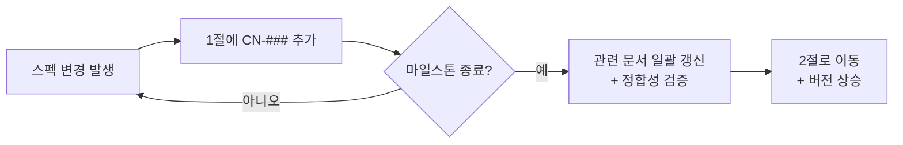

# 변경이력

> - **버전**: v0.1
> - **최종 수정**: 2026-09-22 (KST)
> - **상태**: 초안
> - **기준 코드**: `main @ 1ba5a1c`
> - **역할**: 모든 스펙 변경을 `CN-###` 단위로 추적한다. 마일스톤까지 쌓아 두었다가 일괄 반영한다.
> - **관련**: [마스터인덱스](마스터인덱스.md) · [작성 규칙](../README.md)

---

## 0. 한 장 요약

| 항목 | 내용 |
| --- | --- |
| 무엇인가 | 문서·설계 변경의 **단일 대장** |
| 왜 필요한가 | [작성 규칙 2.2절](../README.md)에 따라 버전은 마일스톤에서만 올린다. 그 사이의 변경을 잃지 않으려면 어딘가에 쌓아야 한다 |
| 어떻게 쓰는가 | 스펙이 바뀌면 **미반영 변경노트** 절에 `CN-###` 한 줄 추가. 마일스톤 종료 시 **반영 완료**로 옮기고 관련 문서를 일괄 갱신 |
| ID 규칙 | `CN-###`. **절대 재사용하지 않는다** — 폐기해도 번호를 회수하지 않는다 ([작성 규칙 3절](../README.md)) |

---

## 1. 미반영 변경노트

> 아래 항목은 아직 관련 문서에 **반영되지 않은** 스펙 변경입니다.
> 마일스톤 종료 시 해당 문서를 갱신하고 2절로 옮깁니다.

| CN | 일시 | 요약 | 영향 문서 | 근거 | 상태 |
| --- | --- | --- | --- | --- | --- |
| CN-001 | 2026-09-22 | **과제 상세 안내(A-1~A-6) 수신 → 범위 전면 변경** — 목표 기능이 "용어사전 1개"에서 "두 사이트 통합 + 10단원 재구성 + RAG 인덱싱 + GNB/LNB 재배치 + EC2 배포"로 확대됨 | 과업지시서 · 범위기술서 · 요구사항정의서 · ADR-0001 · docs/README.md (5절) | [과제-상세-안내.md 4.1절](../10-착수/과제-상세-안내.md) — A-1~A-6 이 기존 설계의 전제를 두 군데서 무너뜨림 | 미반영 |
| CN-002 | 2026-09-22 | **별도 저장소 분리** — `projects/domain-rag-lab` 작업본에서 `projects/investment-rag-lab` 으로 이전. GitHub: `EST-Bootcamp-Dongwon/investment-rag-lab`, GitLab: `mygithub05253/investment-rag-lab`. 기준 코드 sha 가 `a13b9a8` → `1ba5a1c` 로 변경 | 전 문서의 머리말 `기준 코드` | 과제 요건 A-5 "레포지토리는 무조건 별도로 파서 하기" | 미반영 |
| CN-003 | 2026-09-22 | **일정 압축** — 20세션 로드맵(S01~S20)이 **이틀**(9/22~9/23)로 축소됨 | 과업지시서 6절 · 범위기술서 3절 · 30-일정/ 전체 | 과제 요건 A-6 "오늘부터 내일까지 이틀만 사용할 수 있으면 된다" | 미반영 |
| CN-004 | 2026-09-22 | **학습 자료 색인 범위 확대** — `docs/` 를 의도적으로 색인하지 않던 방침(docs/README.md 5절)을 변경해야 함. 3주 학습 내용을 RAG 로 인덱싱하는 것이 과제 요건 자체(A-3)이므로 색인 대상을 넓히되 단원 메타데이터로 분리 | docs/README.md 5절 · RAG 파이프라인 · ADR 신규 | 과제 요건 A-2 + A-3 | 미반영 |
| CN-005 | 2026-09-22 | **GNB/LNB 2단 구조로 전면 재편** — 현재 메뉴(홈·종목보기·RAG 질문 등 단층)를 상단 GNB + 좌측 LNB 로 바꿔야 함 | 범위기술서 2.3절 · 40-화면/ | 과제 요건 A-4 "GNB/LNB 구조로 재구성" | 미반영 |
| CN-006 | 2026-09-22 | **REQ-001~005 재정의 필요** — 범위기술서 2.1절이 예약한 REQ-001~005 의 정의가 "용어사전 1개" 전제에 기반. 과제 상세 요건에 맞춰 다시 정의해야 함 | 범위기술서 2.1절 · 요구사항정의서 | CN-001 의 결과 | 미반영 |
| CN-007 | 2026-09-22 | **ADR-0001 범위 변경** — 원래 "통합 범위를 용어사전 한 기능으로 한정한다" 였으나, 과제 상세에 의해 전면 통합으로 확대됨. ADR-0001 을 **대체(superseded)** 하고 새 ADR 을 작성해야 함 | decisions/0001-*.md | CN-001 의 결과 | 미반영 |
| CN-008 | 2026-09-22 | **제출물 형식 확정** — `이동원 - <EIP> - https://github.com/EST-Bootcamp-Dongwon/investment-rag-lab` 3요소. 프리티어 한계점 별도 첨부 | 95-배포운영/ | [과제-상세-안내.md 6절](../10-착수/과제-상세-안내.md) | 미반영 |

---

## 2. 반영 완료

> 마일스톤에서 일괄 반영된 항목입니다. 아직 없습니다.

| CN | 반영 일시 | 반영 마일스톤 | 갱신된 문서 | 버전 변경 |
| --- | --- | --- | --- | --- |
| — | — | — | — | — |

---

## 3. 운영 규칙

### 3.1 CN 작성법

1. 스펙이 바뀌면 **즉시** 1절에 한 줄 추가한다.
2. ID 는 `CN-001` 부터 순번. **절대 재사용하지 않는다.**
3. **근거**를 반드시 적는다 — 과제 요건(A-#), 사용자 결정, 코드 실측, 또는 `(확인 필요)`.
4. **영향 문서**에는 갱신이 필요한 문서를 모두 나열한다.

### 3.2 반영 절차

### 3.3 폐기

CN 이 불필요해지면 상태를 `폐기` 로 바꾸고 사유를 적는다. 행을 삭제하지 않는다.
