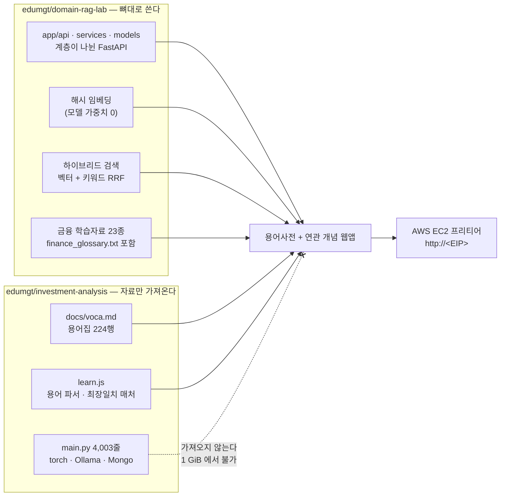
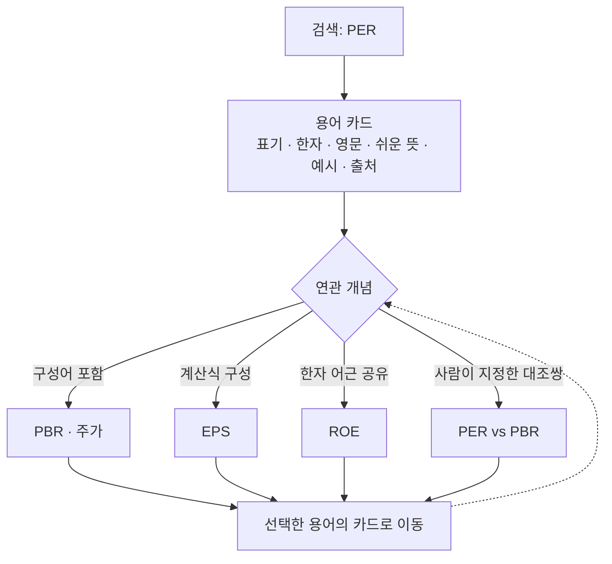
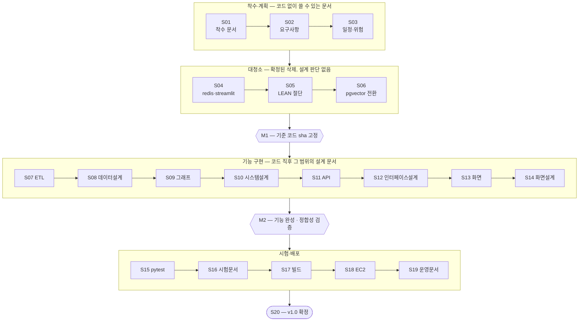
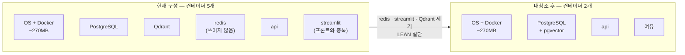

# 과업지시서

> - **버전**: v0.1
> - **최종 수정**: 2026-09-21 (KST)
> - **상태**: 초안
> - **기준 코드**: `main @ a13b9a8`
> - **역할**: 과업의 배경·목표·산출물·수행 체계·제약을 확정한다. 이후 모든 문서가 이 문서를 근거로 삼는다.
> - **관련**: [범위기술서](범위기술서.md) · [작성 규칙](../README.md) · [출처 표기](../../NOTICE.md) · [시험 원문](../../test.md)

---

## 0. 한 장 요약

| 항목 | 내용 |
| --- | --- |
| 과업명 | 주식·금융·경제 기본 용어사전과 연관 개념 탐색 웹앱 |
| 성격 | **단순 개인 프로젝트** (1인 · 자체 승인) |
| 출발점 | 강사님 시험 과제 — `edumgt/investment-analysis` + `edumgt/domain-rag-lab` 통합 후 EC2 배포 |
| 목표 기능 | **단 하나** — 용어사전 조회·검색 + 연관 개념 탐색 |
| 최우선 제약 | AWS 프리티어 **1 GiB RAM**, 비용 **0원** |
| 산출물 | SI 산출물 **10개 구분** 전부 (약 30종 문서) |
| 배포 형태 | EC2 단일 인스턴스 · `http://<EIP>` · 도메인 없음 |
| 일정 | 20세션 (1세션 = 작업 1~2개) · 마일스톤 2개 |

---

## 1. 과업 배경

### 1.1 시험 원문이 요구한 것

원문은 [`test.md`](../../test.md) 에 있습니다. 요구는 네 가지입니다.

| ID | 요구 | 출처 |
| --- | --- | --- |
| T-1 | `edumgt/investment-analysis` 웹앱과 `edumgt/domain-rag-lab` 웹앱을 **하나로 통합** | `test.md:3-4` |
| T-2 | 해당 기능에서 **본인만의 금융·경제 정보 웹앱으로 메뉴·기능을 개편** | `test.md:6` |
| T-3 | **AWS EC2 에 올려 EIP 를 공유** | `test.md:7` |
| T-4 | (여유가 되면) 람다·API GW 추가 | `test.md:14` |

T-4 는 이 프로젝트의 **비범위**입니다 — 근거는 [범위기술서 4.2절](범위기술서.md).

### 1.1.1 무엇을 통합한다는 것인가

두 원본은 **성격이 전혀 다릅니다.** 하나는 잘 정리된 RAG 서버이고, 다른 하나는
기능이 많지만 무거운 학습용 웹앱입니다. "통합"을 **코드를 전부 합치는 것**으로 읽으면
프리티어에서 아예 뜨지 않습니다.

**판단**: `domain-rag-lab` 의 **구조**를 뼈대로 삼고, `investment-analysis` 에서는
**용어 자료와 파싱 로직만** 가져옵니다. 근거는 [범위기술서 5절](범위기술서.md).

### 1.2 하루 과제를 개인 프로젝트로 확장하는 이유

원문의 제출 기한은 당일 16시였습니다. 그 범위로는 "동작하는 화면"까지만 나오고
**왜 그렇게 만들었는지가 남지 않습니다.** 이 과업은 같은 결과물을 만들되,
설계 판단과 그 근거를 SI 산출물 형태로 남기는 것을 함께 목표로 합니다.

### 1.3 이 프로젝트의 성격과 판단 우선순위

**이것은 단순 개인 프로젝트입니다.**

이 코드를 가져갈 별도의 통합 프로젝트가 있으나, 그쪽에서 알아서 커스터마이징하거나
사용하지 않을 수도 있습니다. 따라서 **이식성을 설계 제약으로 삼지 않습니다.**
"나중에 떼어갈 때를 위한" 추상화는 넣지 않습니다.

판단이 갈릴 때는 아래 순서로 정합니다.

| 순위 | 기준 | 뜻 |
| --- | --- | --- |
| 1 | **프리티어 1 GiB 안에서 확실히 돌아갈 것** | 메모리를 쓰는 선택은 근거를 대야 한다 |
| 2 | **기능 1개를 제대로 완성할 것** | 기능 확장이 목적이 아니다 |
| 3 | **산출물 문서로 설명 가능할 것** | 근거 없는 설계를 하지 않는다 |
| 4 | **단순할 것** | 지금 쓰지 않는 추상화를 넣지 않는다 |

---

## 2. 과업 목표

### 2.1 목표 기능 — 단 하나

**주식·금융·경제 기본 용어사전과 연관 개념 탐색.**

사용자가 금융 용어를 찾아보고, 그 용어와 **어떤 개념이 왜 연관되는지**를 따라가며
이해를 넓히는 것이 전부입니다.

사용자가 실제로 겪는 흐름은 이렇습니다.

> 사용자가 **"PER"** 을 검색한다 → 용어 카드가 뜬다
> (株價收益比率 · Price Earnings Ratio · "주가가 순이익의 몇 배인가")
> → 카드 아래에 **연관 개념**이 근거와 함께 뜬다
> — `PBR`("같은 '주가' 로 시작하는 짝"), `EPS`("PER 계산식에 들어간다"),
> `ROE`("한자 '益(이익)' 을 공유한다")
> → 그중 하나를 누르면 그 용어의 카드로 이동한다 → 반복

즉 **사전이면서 동시에 지도**입니다. 단어를 찾는 데서 끝나지 않고,
**"왜 이게 저것과 관련 있는지"** 를 보여줘 개념망을 따라가게 합니다.

각 간선에는 **왜 연관되는지(`evidence`)** 가 반드시 붙습니다. "관련 있어 보인다"가
아니라 "이 한자를 공유한다", "이 단어를 포함한다" 처럼 **확인 가능한 근거**여야 합니다.

### 2.2 목표가 아닌 것

오해를 막기 위해 명시합니다.

- **기능 확장이 아니다** — 시세 분석·백테스트·포트폴리오 최적화는 목표가 아닙니다.
- **성능 최적화가 아니다** — 프리티어에서 "돌아가는" 것이 기준이지 "빠른" 것이 기준이 아닙니다.
- **팀 협업 체계 구축이 아니다** — 1인 프로젝트입니다. 브랜치 전략·코드 리뷰 절차는 만들지 않습니다.
- **원본의 모든 기능을 보존하는 것이 아니다** — 프리티어에서 못 도는 것은 잘라냅니다.

### 2.3 성공 판정 기준

전부 측정 가능해야 합니다. 측정은 S18(배포) 이후 `90-시험/` 에 기록합니다.

| ID | 기준 | 검증 방법 |
| --- | --- | --- |
| G1 | 외부에서 `http://<EIP>/` 로 접속된다 | 다른 네트워크의 브라우저에서 접속 |
| G2 | 용어 **N건**이 검색·조회된다 | `GET /api/glossary/terms` 응답 건수. **N 은 S07 ETL 실측으로 확정** `(확인 필요)` |
| G3 | 임의 용어에서 **연관 개념이 근거와 함께** 제시된다 | 각 간선에 `evidence` 가 비어 있지 않을 것 |
| G4 | `.env` 에 LLM 키가 **없어도** G1~G3 가 전부 동작한다 | 키를 비우고 전체 시나리오 재실행 |
| G5 | 컨테이너 RSS 합계가 상한 이내다 | `docker stats --no-stream` · 상한은 `60-시스템/자원-산정.md` 에서 확정 `(확인 필요)` |

---

## 3. 과업 범위 개요

**만드는 것**: 용어사전 조회·검색·분류 브라우징 화면, 연관 개념 탐색 화면,
이를 받치는 API 와 용어 데이터 파이프라인, 그리고 EC2 배포.

**안 만드는 것**: 목표 기능과 무관한 신규 기능, 프리티어에서 못 도는 구성 요소.

상세는 [범위기술서](범위기술서.md) 를 보십시오.

---

## 4. 산출물 목록

첨부받은 산출물 표는 **퀀트 트레이딩 시스템 일반**을 상정한 것이라, 이 프로젝트에
해당 없는 항목이 섞여 있습니다. 해당 없는 항목은 만들지 않고 **사유를 남깁니다.**

| # | 구분 | 폴더 | 만드는 것 | 해당없음(N/A)과 사유 |
| --- | --- | --- | --- | --- |
| 1 | 착수·과업 정의 | `10-착수/` | 과업지시서 · 범위기술서 · 프로젝트 개요 | 예산 — 비용 0원 / 이해관계자 목록 — 1인 |
| 2 | 요구사항 관리 | `20-요구사항/` | 요구사항정의서 · 요구사항 추적표(RTM) · 인수 기준 | — |
| 3 | 일정·업무 관리 | `30-일정/` | WBS · 마일스톤 · 세션 로드맵 · 이슈·리스크 대장 | 담당자 배정·주간보고 — 1인 |
| 4 | 화면·서비스 설계 | `40-화면/` | IA · 화면목록 · 화면 상세 · 용어 모달 사양 | 전략·백테스트·성과 대시보드 흐름 — **기능 범위 밖** |
| 5 | 데이터 설계 | `50-데이터/` | 용어 데이터모델 · ERD · ETL 파싱규칙 · 연관그래프 산출규칙 · 원천자료 대장 | 주문·포트폴리오 데이터 — **기능 범위 밖** |
| 6 | 시스템 설계 | `60-시스템/` | 아키텍처 · 컴포넌트 구성 · 자원 산정 · ADR | — |
| 7 | 인터페이스 설계 | `70-인터페이스/` | API 목록 · API 상세명세 · 공통 응답과 에러 · LLM 연동 인터페이스 | **증권사 연동·Webhook — 해당 없음** |
| 8 | 개발·형상 관리 | `80-개발형상/` | 개발표준 · 형상관리 규약 · CI 파이프라인 · 환경변수 대장 · 변경이력 | 브랜치 전략 → **main 직커밋 규약으로 대체** / 코드 리뷰 기록 — 1인 |
| 9 | 시험·성과 검증 | `90-시험/` | 시험계획서 · 시험 케이스 · 시험시나리오 결과서 · 성능 측정결과 | **백테스트 보고서·LEAN·TradingView — 해당 없음** |
| 10 | 배포·운영·인수 | `95-배포운영/` | 배포계획서 · 운영 런북 · 인수인계서 · 점검 체크리스트 · 릴리스 노트 | 장애 대응 절차 — 개인 데모 수준으로 축약 |

### 4.1 도구 — 전부 무료로 대체

표가 지정한 도구는 유료이거나 계정이 필요합니다. 비용 0원 제약에 맞춰 대체합니다.

| 표의 도구 | 대체 | 이유 |
| --- | --- | --- |
| Confluence | **Markdown** (`docs/`) | git 이력으로 변경 추적이 되므로 오히려 낫다 |
| JIRA · JIRA 칸반/Scrum | **GitHub Issues** · `30-일정/` 문서 | 1인이라 보드 운영 비용이 이득보다 크다 |
| Figma · FigJam | **Mermaid** + ASCII 와이어프레임 | 화면이 적고 디자인 산출물이 목표가 아니다 |
| ERDCloud · dbdiagram.io · Lucidchart · draw.io | **Mermaid** | 문서 안에 인라인으로 들어가 링크가 깨지지 않는다 |
| Postman | **curl** + pytest | CI 에서 그대로 재실행된다 |
| Google Sheets · Excel | **Markdown 표** | 상동 |
| Amazon CloudWatch | 기본 지표만 | 커스텀 지표·로그 그룹은 **과금 위험** |

---

## 5. 수행 체계

### 5.1 역할

1인 수행. AI 코딩 에이전트를 보조로 사용하며, 에이전트 관여는 커밋 푸터
(`Co-Authored-By`)로 명시합니다. 승인은 자체 승인입니다.

### 5.2 작업 단위 규칙

**한 세션에 작업 1~2개만** 진행합니다. 세션이 길어지면 판단 품질이 떨어지고
맥락이 끊깁니다. 각 세션의 마감에는 다음이 따릅니다.

1. `worklogs/YYYY-MM-DD_주제.md` TIL 작성
2. `dashboards/YYYY-MM-DD/progress_dashboard.html` 갱신
3. 서브모듈 → 부모 순서로 커밋, **GitHub·GitLab 양쪽 push**
4. 무엇을 어디에 올렸는지 보고

근거: 모노레포 `AGENTS.md` 4·5절.

### 5.3 의사결정 기록 (ADR)

설계 판단은 `decisions/NNNN-한국어-제목.md` 에 남깁니다. 절 구성은
**맥락 / 결정 / 근거 / 결과** 로 고정합니다. 폐기할 때는 옛 문서를 고치지 않고
머리에 폐기 배너만 답니다.

작성 예정 목록:

| 번호 | 제목 | 세션 |
| --- | --- | --- |
| 0001 | 통합 범위를 용어사전 한 기능으로 한정한다 | S02 |
| 0002 | 벡터 저장소를 Qdrant 에서 pgvector 로 접는다 | S06 |
| 0003 | LLM 을 선택적 보강으로 두고 기본값을 끈다 | S11 |
| 0004 | 연관 개념을 LLM 없이 결정적 그래프로 만든다 | S09 |
| 0005 | 용어사전을 빌드타임 ETL · JSON 시드로 고정한다 | S07 |
| 0006 | redis · streamlit · LEAN 을 제거한다 | S04 |
| 0007 | 이미지 빌드를 EC2 밖에서 수행한다 | S17 |
| 0008 | 원본 저작권 표기를 NOTICE 로 승계한다 | S01 (완료 — [NOTICE.md](../../NOTICE.md)) |

### 5.4 문서 버전 정책

작업 중에는 버전을 올리지 않고 `CN-###` 변경노트에 쌓아둡니다. 마일스톤 종료 시
한 번에 올립니다. 상세는 [작성 규칙 2.2절](../README.md).

---

## 6. 일정 개요

세션 단위로 진행합니다. 상세 WBS 는 S03 에서 `30-일정/` 에 정본화합니다.

| 구간 | 세션 | 내용 |
| --- | --- | --- |
| 착수·계획 | S01~S03 | 착수 문서 · 요구사항 · 일정 (코드 의존 없음) |
| 대청소 | S04~S06 | redis·streamlit 제거 · LEAN 절단 · pgvector 전환 |
| **M1** | — | **기준 코드 sha 고정** — 이후 설계 문서가 이 sha 를 인용 |
| 기능 구현 | S07~S14 | ETL → 데이터설계 → 그래프 → 시스템설계 → API → 인터페이스설계 → 화면 → 화면설계 |
| **M2** | — | **기능 완성** — 요구사항↔ERD↔API↔화면 정합성 검증 |
| 시험 | S15~S16 | pytest 도입 · CI 편입 · 시험 문서 |
| 배포 | S17~S19 | 빌드 파이프라인 · EC2 기동 · 배포·운영 문서 |
| 확정 | S20 | 전체 정합성 검증 · **v1.0** |

### 6.1 세션 흐름도

세션은 **문서와 코드를 번갈아** 갑니다. 아래에서 파란 계열이 문서, 회색이 코드입니다.

### 6.2 왜 이 순서인가

순서를 정한 이유가 세 가지 있습니다.

| 질문 | 답 |
| --- | --- |
| 문서를 전부 먼저 쓰면 안 되나? | 안 됩니다. [작성 규칙 2.1절](../README.md)이 "숫자·동작은 `파일:줄`·실측·URL 중 하나"를 요구합니다. 코드가 없는 상태에서 API 명세·ERD 를 쓰면 전부 `(확인 필요)` 로 덮여 **두 번 쓰게 됩니다.** |
| 코드를 전부 먼저 짜면 안 되나? | 안 됩니다. 그러면 산출물이 **사후 정당화**가 됩니다. 설계→구현 추적성이 SI 산출물의 존재 이유입니다. |
| 그런데 왜 대청소(S04~S06)만 문서보다 앞인가? | 대청소는 **설계가 아니라 확정된 삭제**입니다. 그리고 문서 머리말의 `기준 코드 main @ <sha>` 가 흔들리지 않으려면 **큰 삭제가 먼저 끝나 있어야** 합니다. 설계 문서를 쓴 뒤 3.8MB 를 지우면 그 문서의 기준 sha 가 즉시 낡습니다. |

---

## 7. 제약 조건

### 7.1 비용 — 절대 0원

AWS 프리티어 범위를 벗어나지 않습니다. 과금이 확인되면 **즉시 중단**하고 원인을 제거합니다.
점검 항목은 `95-배포운영/점검체크리스트.md` 에서 확정합니다.

> ⚠️ AWS 프리티어 정책이 2025년 신규 계정부터 크레딧 방식으로 바뀌었을 가능성이 있습니다.
> **S18 시작 전에 콘솔에서 실제 한도를 확인**합니다. `(확인 필요)`

### 7.2 자원 — 1 GiB RAM

t2/t3.micro 는 **1 GiB** 입니다. 이 제약이 아키텍처 선택의 1순위 근거입니다.

**Ollama 등 자체 호스팅 LLM 은 불가능합니다.** 근거 두 가지:

- **메모리** — OS(~180MB) + Docker(~90MB) + 앱 + PostgreSQL 을 빼면 약 300MB 가 남습니다.
  Ollama 의 최소 실용 모델 `qwen2.5:0.5b` Q4 조차 가중치만 ~400MB 이고, KV 캐시와 런타임을
  더하면 700MB~1GB RSS 입니다. `(확인 필요 — 공개 모델 파일 크기 기준 추정치)`
- **CPU** — 추론은 CPU 를 지속적으로 100% 사용합니다. t2/t3.micro 는 버스터블이라
  CPU 크레딧이 소진되면 **baseline 으로 스로틀**됩니다.

인스턴스를 키우면 해결되지만 그 순간 7.1 을 위반합니다. 따라서 **LLM 없이 동작하되

메모리가 어떻게 쓰이는지 그림으로 보면 이렇습니다. 제거 대상을 걷어내야 여유가 생깁니다.

| 제거 대상 | 왜 지워도 되는가 |
| --- | --- |
| **redis** | `app/` 전체에 `import redis` 가 **0건**입니다. 설정과 컨테이너만 있고 아무도 쓰지 않습니다 |
| **streamlit** | `streamlit_app.py` 의 3개 탭이 vanilla-JS 프론트와 **완전히 중복**됩니다 |
| **Qdrant** | PostgreSQL 이 어차피 뜨고, `pgvector` 확장이 **이미 그 이미지 안에** 있으며, 장기기억 테이블이 **이미 쓰고 있습니다**. 용어 규모(약 1,100건 × 384차원 ≈ 1.7MB)는 벡터 DB 를 따로 둘 크기가 아닙니다 |
| **LEAN** | 이미지가 수 GB 이고 실행에 1~2GB RAM 을 요구합니다. 게다가 `/var/run/docker.sock` 마운트가 필요한데, 이는 **컨테이너 안에서 호스트를 장악할 수 있는 권한**입니다 |

구체적인 수치 추정은 S10 의 `60-시스템/자원-산정.md`, 실측은 S18 의 `90-시험/성능-측정결과.md`
에 기록합니다. **지금 단계에서 숫자를 단정하지 않습니다.**
연결만 열어두는** 구성을 택합니다 — ADR-0003.

### 7.3 저작권

**원본 저장소 두 곳 모두 LICENSE 파일이 없습니다. 구두 허가만 받았습니다.**
이 작업본은 **GitHub·GitLab 양쪽 모두 Public** 입니다.

- 출처 표기는 [`NOTICE.md`](../../NOTICE.md) 에 유지하고, 자료를 반입할 때마다 먼저 갱신합니다.
- 교재·강의자료 PDF·실습 zip·데이터 원본·시크릿은 **형태를 불문하고 커밋하지 않습니다.**
- 판단이 서지 않으면 올리지 않고 확인합니다.

근거: 모노레포 `AGENTS.md` 7.1절.

### 7.4 작업 규약

모노레포 `AGENTS.md` 를 단일 진실 원천으로 따릅니다. 이 과업에 직접 걸리는 항목:

| 항목 | 규약 |
| --- | --- |
| 언어 | 대화·주석·커밋·문서 모두 한국어. 식별자만 영문 |
| 들여쓰기 | 2 spaces |
| 날짜·시간 | **KST** 기준 |
| 브랜치 | **main 직커밋.** 브랜치·PR 을 만들지 않는다 |
| 되돌리기 | `git revert`. force push·`reset --hard`·히스토리 재작성은 **사용자 승인 후에만** |
| 커밋 메시지 | Conventional Commits + 한국어 요약 (`feat:` `docs:` `chore:` `fix:`) |
| push | **`origin`(GitHub) 과 `gitlab` 양쪽 모두.** 한쪽만 올리면 두 원격이 갈라진다 |
| 서브모듈 | 안쪽부터 커밋 → 부모 gitlink 갱신 |

### 7.5 기준 원본 커밋

용어 원천 자료는 강사님 원본에서 옵니다. 원본이 바뀌면 ETL 결과가 바뀌므로,
**이 시점의 커밋을 기준으로 고정**하고 변경 시 `CN-###` 로 추적합니다.

2026-09-21 동기화 후 실측:

| 원본 | 커밋 | 일시 | 비고 |
| --- | --- | --- | --- |
| `edumgt/domain-rag-lab` (th07 lecture) | `e9b41429ad3387528970f22909294717b7a4bfc8` | 2026-09-21 12:00 | 원격 최신과 일치 |
| `edumgt/investment-analysis` (th01 lecture) | `2cb9b7f65e3b5bf16cbd9d5849ab2aaa25a2412b` | 2026-09-14 21:08 | 원격 최신과 일치 |
| 이 작업본 | `a13b9a80e4e7587cf5bfbd2e96ad80a23e054cea` | 2026-09-21 09:43 | 원본 `e9b4142` **1건 미반영** |

**용어 원천 자료 실측** (`wc -l` · `du -h` · `sha256sum` 기준 2026-09-21):

| 파일 | 줄 수 | 크기 | sha256 앞 12자 |
| --- | --- | --- | --- |
| `data/samples/finance_glossary.txt` | 1,547 | 108K | `1e198600ed0b` |
| `investment-analysis/docs/voca.md` | 267 | 52K | `898ac4f8d2ce` |

구조 실측은 [범위기술서 2.2절](범위기술서.md) 에 있습니다.

---

## 8. 전제·가정과 `(확인 필요)` 목록

| # | 항목 | 상태 |
| --- | --- | --- |
| 1 | 최종 용어 건수 (G2 의 N) | S07 ETL 실행 후 확정 |
| 2 | 컨테이너 RSS 합계 상한 (G5) | S10 자원 산정에서 추정 → S18 실측 |
| 3 | AWS 프리티어 적용 조건 (계정 생성 시점에 따라 다름) | S18 이전 콘솔 확인 |
| 4 | Ollama 최소 모델의 실제 RSS | 공개 파일 크기 기준 추정. 실측하지 않음 (실측할 이유가 없음 — 도입하지 않으므로) |
| 5 | 강사님 원본 `e9b4142` 1건을 작업본에 얹을지 | 미정. `AGENTS.md` 2.4절상 기본은 "얹지 않는다" |

---

## 9. 승인

| 항목 | 내용 |
| --- | --- |
| 작성 | 이동원 · 2026-09-21 (KST) |
| 승인 | 자체 승인 (1인 프로젝트) |
| 상태 | **초안** — S02 요구사항정의서 작성 시 2.3절 목표 기준을 재검토한다 |

---

## 부록 A. 이 문서의 용어 정의

| 용어 | 뜻 |
| --- | --- |
| **원본 (lecture)** | 강사님이 배포한 저장소. `learning/thNN-*/lecture` 서브모듈. **읽기 전용이며 절대 수정하지 않는다** |
| **작업본** | 내 저장소. `projects/domain-rag-lab`. 코드 수정은 여기서만 한다 |
| **upstream** | 작업본에서 원본을 가리키는 git 원격. fetch 전용이며 push 가 막혀 있다 |
| **세션** | 작업 1~2개 단위의 작업 묶음. 끝날 때마다 TIL·대시보드·커밋·push 가 따른다 |
| **산출물 구분** | 첨부 산출물 표의 10개 행. 이 저장소에서는 `docs/` 의 번호 폴더와 1:1 대응한다 |
| **마일스톤** | 문서 버전을 일괄 상승시키는 지점. M1(대청소 완료) · M2(기능 완성) 두 개 |

## 부록 B. 참조 문서

- [작성 규칙](../README.md) — 이 폴더의 문서 규약
- [범위기술서](범위기술서.md) — 무엇을 만들고 무엇을 안 만드는가
- [출처 표기](../../NOTICE.md) — 원본과 저작권
- [시험 원문](../../test.md) — 과업의 출발점
- 모노레포 `AGENTS.md` — 협업·커밋·보안 규약의 단일 진실 원천
