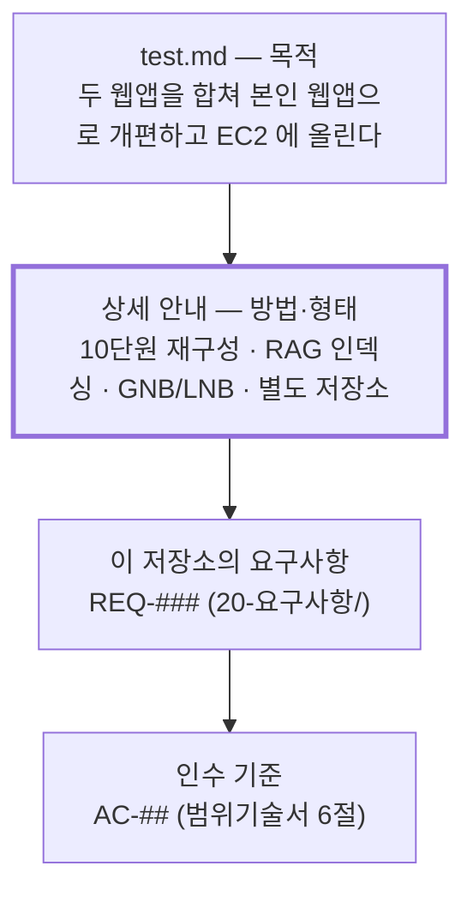

# 과제 상세 안내 (원문 보존)

> - **버전**: v1.0
> - **최종 수정**: 2026-09-22 (KST)
> - **상태**: 확정 — 원문이므로 고치지 않는다
> - **기준 코드**: 해당 없음 (코드를 인용하지 않는 원문 보존 문서)
> - **역할**: 과업의 근거 원문을 **손대지 않은 형태로** 보존한다. 이후 모든 문서는 요건을 이 문서의 ID로 인용한다.
> - **관련**: [과업지시서](과업지시서.md) · [범위기술서](범위기술서.md) · [시험 원문](../../test.md)

---

## 0. 한 장 요약

| 항목 | 내용 |
| --- | --- |
| 무엇인가 | 7차 학습 평가 과제의 **상세 요건 원문** |
| 언제 받았나 | 2026-09-22 (KST) |
| 어떻게 받았나 | 사용자가 대화로 전달 |
| 강사님 저장소에 있나 | **없다** — 검색 결과 0건 (2절) |
| 왜 이 문서가 필요한가 | 요건이 코드·저장소 어디에도 없어, 인용할 1차 출처를 만들어야 한다 |
| 요건 개수 | 6개 (A-1 ~ A-6) |
| 앞선 원문과의 관계 | [`test.md`](../../test.md) 를 **대체하지 않고 상세화**한다 (3절) |

---

## 1. 원문 (그대로)

아래는 전달받은 문장을 **한 글자도 고치지 않고** 옮긴 것입니다. 오탈자·띄어쓰기도 원문 그대로입니다.

> 7차 학습 평가
> 평가 과제 : domain-rag-lab과 investment-analysis의 통합 및 AWS EC2 서버 배포
> 상세 요건 : 3주 간의 학습을 모두 통합하여 10단원으로 재구성하고, 해당 학습 내용을 RAG로 인덱싱하여 본인만의 금융 상식 시스템으로 개편합니다. 또한 두 사이트의 각종 기능을 재배치하고 GNB/LNB 구조로 재구성
> 레포지토리는 무조건 별도로 파서 하기
> 제출 및 일정 : 작업 후 디스코드에 이동원 - 1.2.3.4 - github.com/test 형식으로 이름, 배포 서버 IP, 본인의 GitHub 채널 주소를 기재하기

전달 시 함께 받은 구두 조건입니다.

> - 기존 `domain-rag-lab` 이나 `investment-analysis` 는 **별도 보관**한다.
> - 로컬 폴더명도 `investment-rag-lab` 으로 맞춘다.
> - **로컬로 완전하게 실행되는 것을 확인한 뒤** AWS EC2 에 배포한다.
> - 서버는 **오늘부터 내일까지 이틀만** 사용할 수 있으면 된다.
> - 일단 **프리티어**로 진행하고, 제출할 때 **프리티어로 인한 한계점을 명시**한다.
> - **기능 구현은 전부 다 되어야** 한다.

---

## 2. 이 원문의 출처와 그 한계

**이 요건은 강사님 저장소 어디에도 없습니다.** 확인한 내용은 다음과 같습니다.

```bash
# 2026-09-22 실행
cd learning/th07-domain-rag-lab/lecture
grep -rniE "10단원|10 단원|GNB|LNB|7차" --include="*.md" .
# → 0건
diff <(git show HEAD:test.md) ../../../projects/domain-rag-lab/test.md
# → 차이 없음 (작업본 test.md 는 원본과 동일)
```

즉 강사님이 배포한 [`test.md`](../../test.md) 에는 "10단원", "RAG 인덱싱", "GNB/LNB" 라는 말이
**한 번도 나오지 않습니다.** 상세 요건은 저장소 밖(디스코드·구두)으로 전달된 것입니다.

**그래서 이 문서를 만들었습니다.** 작성 규칙([`docs/README.md` 2.1절](../README.md))이
"근거 없는 문장을 쓰지 않는다"를 요구하는데, 정작 과업의 가장 중요한 근거가 인용할 수 없는
형태로만 존재했기 때문입니다. 이후 문서는 요건을 `A-1` ~ `A-6` 으로 인용하고, 그 정의는 이 문서입니다.

> ⚠️ **원문 해석에 다툼이 생기면 이 문서가 아니라 강사님 말씀이 우선합니다.**
> 이 문서는 전달받은 문장의 사본일 뿐 해석 권한을 갖지 않습니다.

---

## 3. 앞선 원문(`test.md`)과의 관계

두 원문은 **충돌하지 않고 층이 다릅니다.**

| | `test.md` (강사님 저장소) | 이 문서 (2026-09-22 전달) |
| --- | --- | --- |
| 층위 | 과제의 **목적** | 과제의 **방법과 형태** |
| 통합 | "하나로 합침" | 합친 결과를 **10단원 + GNB/LNB** 로 구성 |
| 개편 | "본인 만의 금융, 경제 정보 웹앱" | 그 정체를 **금융 상식 시스템(RAG 기반)** 으로 특정 |
| 저장소 | 언급 없음 | **별도 저장소 필수** |
| 배포 | EC2 + EIP 공유 | 같음. 프리티어 · 이틀 · 한계점 명시 추가 |
| 제출 | `홍길동 - http://IP` | `이동원 - IP - GitHub 주소` (3요소) |



**따라서 `test.md` 는 폐기되지 않습니다.** 목적을 묻는 문장은 계속 `test.md` 를 인용하고,
방법·형태를 묻는 문장은 이 문서를 인용합니다.

---

## 4. 요건 분해 — A-1 ~ A-6

1절 원문을 **검증 가능한 단위**로 쪼갠 것입니다. 쪼개기만 했고 내용을 더하지 않았습니다.
각 요건은 `20-요구사항/요구사항정의서.md` 의 `REQ-###` 로 내려갑니다.

| ID | 요건 | 원문 근거 | 성격 |
| --- | --- | --- | --- |
| **A-1** | `domain-rag-lab` 과 `investment-analysis` 를 **통합**한다 | 1절 "평가 과제" 행 | 범위 |
| **A-2** | 3주 간의 학습을 모두 통합하여 **10단원으로 재구성**한다 | 1절 "상세 요건" 1문 | 데이터·콘텐츠 |
| **A-3** | 그 학습 내용을 **RAG 로 인덱싱**해 **금융 상식 시스템**으로 개편한다 | 1절 "상세 요건" 1문 | 기능 |
| **A-4** | 두 사이트의 각종 기능을 **재배치**하고 **GNB/LNB 구조로 재구성**한다 | 1절 "상세 요건" 2문 | 화면 |
| **A-5** | **별도 저장소**에서 작업한다 (기존 두 곳은 별도 보관) | 1절 "레포지토리" 행 + 구두 조건 | 형상 |
| **A-6** | **AWS EC2 프리티어**에 배포하고 IP·GitHub 주소를 제출한다. 한계점을 명시한다 | 1절 "평가 과제"·"제출 및 일정" 행 + 구두 조건 | 배포 |

### 4.1 요건별로 무엇이 달라졌는가

이 요건들은 **2026-09-21 에 세운 설계의 전제를 두 군데서 무너뜨립니다.** 무엇이 왜 바뀌는지를
여기 적어 두고, 실제 개정은 [과업지시서](과업지시서.md)·[범위기술서](범위기술서.md) 에서 합니다.

| 요건 | 9/21 설계의 전제 | 어떻게 무너지나 |
| --- | --- | --- |
| A-2 · A-3 | 목표 기능은 **단 하나**(용어사전 + 연관 개념)다 | 10단원 학습과 RAG 질의가 **별개의 기능 축**으로 추가된다. "기능 1개" 원칙은 성립하지 않는다 |
| A-3 | `docs/` 와 학습자료는 **색인하지 않는다** (출처가 흐려진다는 이유) | 학습 내용 색인이 **요건 자체**다. 색인 대상을 넓히되 출처가 흐려지지 않게 **단원 메타데이터로 분리**하는 쪽으로 바꿔야 한다 |
| A-4 | 메뉴는 일부 유지·일부 제거한다 | **GNB/LNB 2단 구조로 전면 재편**이다. 화면 설계를 다시 쓴다 |
| A-5 | `projects/domain-rag-lab` 작업본에서 계속 작업한다 | **별도 저장소**로 옮긴다. 기준 코드 sha 가 새로 잡힌다 |
| A-6 | 20세션 로드맵 (S01~S20) | **이틀**이다. 세션 로드맵을 접어야 한다 |

변경은 `00-index/변경이력.md` 의 `CN-###` 로 추적합니다.

---

## 5. 해석이 필요한 대목

원문이 한 가지로만 읽히지 않는 곳입니다. **해석을 고른 근거를 남기고, 틀렸을 가능성을 함께 적습니다.**

| # | 원문 | 갈리는 해석 | 채택 | 근거 |
| --- | --- | --- | --- | --- |
| 1 | "3주 간의 학습" | ① 커리큘럼 10단원(`learning/01~10`) ② 두 웹앱이 담고 있는 금융 학습 자료 | **②** | 이어지는 문장이 "해당 학습 내용을 RAG로 인덱싱"이다. 색인 대상은 두 웹앱 안의 자료다. `(확인 필요 — 강사님 확인 시 ①이면 단원 매핑을 다시 잡는다)` |
| 2 | "10단원으로 재구성" | ① 정확히 10개 ② 대략 10개 | **①** | 숫자를 명시했다. 자료 분포가 10개로 안 갈리면 그 사실을 문서에 적고 10개를 맞춘다 |
| 3 | "각종 기능을 재배치" | ① 두 사이트 기능 전부를 살린다 ② 살릴 수 있는 것만 재배치한다 | **②+명시** | 프리티어 1 GiB 에서 `torch`·`diffusers`·Ollama 는 물리적으로 못 돈다. 사용자 결정(2026-09-22)에 따라 **경량 재구현 + 한계점 명시**로 간다 |
| 4 | "기능 구현은 전부 다 되어야 됨" | ① 원본 기능 100% ② 메뉴에 올린 것은 100% 동작 | **②** | ①은 3과 충돌한다. "메뉴를 눌렀을 때 깨지는 화면이 0건"으로 읽는다 |
| 5 | "이틀만 사용할 수 있으면 된다" | ① 이틀 뒤 내려도 된다 ② 이틀은 반드시 떠 있어야 한다 | **둘 다** | 채점이 IP 접속으로 이뤄지므로 이틀은 떠 있어야 하고, 그 뒤에는 과금 방지를 위해 내린다 |

> ⚠️ **#1 이 이 과업에서 가장 값비싼 해석입니다.** 이것이 틀리면 10단원 구성 전체를 다시 잡아야 합니다.
> 강사님께 확인할 기회가 있으면 **"3주 학습이 커리큘럼 단원인가, 웹앱 학습자료인가"** 를 먼저 물어보십시오.

---

## 6. 제출물 형식

원문이 지정한 형식입니다. **이름·IP·GitHub 주소 3요소**입니다.

```text
이동원 - <EIP> - https://github.com/EST-Bootcamp-Dongwon/investment-rag-lab
```

| 요소 | 값 | 상태 |
| --- | --- | --- |
| 이름 | 이동원 | 확정 |
| 배포 서버 IP | `<EIP>` | **미정** — EC2 기동 후 확정 |
| GitHub 채널 주소 | `https://github.com/EST-Bootcamp-Dongwon/investment-rag-lab` | 확정 |
| (추가) 프리티어 한계점 | `95-배포운영/` 에 정리 후 첨부 | 미작성 |

제출 채널은 디스코드입니다. 원문 `test.md` 에 따르면 다른 훈련생이 IP 에 접속해 100점 이모지를
붙이는 방식으로 채점됩니다 — 즉 **접속했을 때 바로 이해되는 첫 화면**이 점수에 직접 영향을 줍니다.
