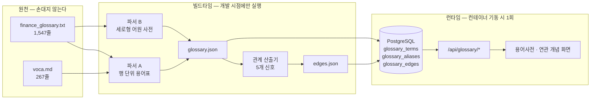
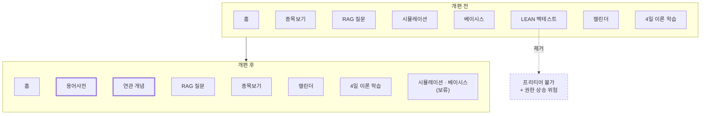

# 범위기술서

> - **버전**: v0.1
> - **최종 수정**: 2026-09-21 (KST)
> - **상태**: 초안
> - **기준 코드**: `main @ a13b9a8`
> - **역할**: 무엇을 만들고 무엇을 만들지 않는지, 그리고 그 판정 근거를 확정한다.
> - **관련**: [과업지시서](과업지시서.md) · [작성 규칙](../README.md) · [출처 표기](../../NOTICE.md)

---

## 0. 한 장 요약

| 항목 | 수 | 비고 |
| --- | --- | --- |
| 기능 범위 (포함) | 5 | 용어 조회 · 검색 · 연관 개념 탐색 · 분류 브라우징 · RAG 질의(조건부) |
| 비범위 (명시적 제외) | 12 | 코드 4 · 인프라 5 · LLM 3 |
| 보류 (판단 유예) | 2 | 시뮬레이션·베이시스 메뉴 |
| 인수 기준 | 10 | AC-01 ~ AC-10 |
| 미해결 질문 | 5 | Q-01 ~ Q-05 |

---

## 1. 범위 판정 방식

모든 항목을 **포함 / 제외 / 보류** 셋 중 하나로 판정합니다.
판정 근거는 반드시 아래 셋 중 하나로 환원되어야 합니다 — 근거를 못 대면 **보류**입니다.

| 근거 | 뜻 |
| --- | --- |
| **1 GiB 제약** | 프리티어 메모리 안에서 못 돌거나, 돌더라도 여유를 지나치게 먹는다 |
| **기능 1개** | 목표 기능(용어사전 + 연관 개념)과 직접 관계가 없다 |
| **단순함** | 지금 쓰지 않는 추상화·구성 요소다 |

근거의 출처는 [과업지시서 1.3절](과업지시서.md)의 판단 우선순위입니다.

---

## 2. 제품 범위 — 무엇을 만드는가

### 2.1 기능 범위

요구사항 ID 는 S02 에서 `20-요구사항/요구사항정의서.md` 에 정식 부여합니다.
아래는 예약입니다.

| 예약 ID | 기능 | 내용 |
| --- | --- | --- |
| REQ-001 | 용어 조회 | 용어 하나의 표기·한자·영문·약어·쉬운 뜻·예시·출처를 본다 |
| REQ-002 | 용어 검색 | 표기·별칭·한자·영문으로 찾는다 |
| REQ-003 | **연관 개념 탐색** | 한 용어에서 연관 용어를 **근거와 함께** 따라간다 |
| REQ-004 | 분류 브라우징 | 원천 자료의 섹션(거시·기술적분석·퀀트 등) 단위로 훑는다 |
| REQ-005 | RAG 질의 | 자연어 질문에 사전 근거로 답한다. **LLM 키가 있을 때만 생성형 답변** |

### 2.2 데이터 범위

원천은 **두 파일**입니다. 실측치는 [과업지시서 7.5절](과업지시서.md).

#### 2.2.0 자료가 화면까지 가는 길

먼저 전체 그림입니다. **마크다운 원문을 런타임에 파싱하지 않고**, 개발 시점에 한 번
JSON 으로 구워 두는 것이 핵심입니다.



**왜 JSON 을 중간에 두는가** — 세 가지 이유가 있습니다.

| 이유 | 설명 |
| --- | --- |
| 파싱 실수가 **눈에 보인다** | 마크다운 파싱 오류는 조용히 숨습니다. JSON 을 git 에 추적하면 `git diff` 로 "용어 3건이 사라졌다"가 드러납니다 |
| 원본 변경을 **자동으로 잡는다** | `build_glossary.py --check` 가 재생성 후 diff 가 0 인지 검사합니다. CI 에 넣으면 강사님 원본이 바뀐 순간 빌드가 실패해 알려줍니다 |
| 부팅이 **빨라진다** | 1,547줄 + 267줄 파싱을 컨테이너가 뜰 때마다 반복하지 않습니다 |

#### 2.2.1 표 구조 전수 조사 (2026-09-21 · `awk` 로 표 헤더 추출)

원천 파일은 단일 형식이 아닙니다. **파서를 종류별로 나눠야 합니다.**

**`data/samples/finance_glossary.txt`** (1,547줄)

| 구분 | 헤더 형태 | 개수 | 처리 |
| --- | --- | --- | --- |
| 용어표 | `\| 용어 \| 한자/약어 \| 영어 \| 아주 쉬운 뜻 \| 실전 예시 \|` 외 변형 | **18개** | **파서 A** (행 단위) |
| 세로형 어원 사전 | `### 용어 (漢字)` + `\| 항목 \| 내용 \|` | 표 **93개** / 제목 **104개** | **파서 B** (블록 단위) |
| 비교 쌍 | `\| 비교 쌍 \| A \| B \| 핵심 차이 \|` (`:331`, `:494`) | 2개 | **관계 간선 원천** — 용어로 넣지 않음 |
| 일본어 유래 대조 | `\| 한국어 \| 한자 \| 일본어 \| 원어 \| 비고 \|` (`:1518`) | 1개 | 어원 보강 — S08 에서 판단 |
| **제외** | `\| 구분 \| 한마디로 \| …\|` (`:364`), `\| 구분 \| 뜻 \| 계산식 \| 읽는 방법 \|` (`:467`), `\| 기호 \| 의미 \|` (`:591`) | 3개 | 용어표가 아니다 |

**`investment-analysis/docs/voca.md`** (267줄)

| 줄 | 헤더 | 데이터 행 | 처리 |
| --- | --- | --- | --- |
| `:11` | `\| 말 \| 한자·영어 \| 말의 구조 \| 초보자용 뜻·예시 \|` | 14 | 파서 A |
| `:30` | `\| 보고 싶은 것 \| 가장 단순한 계산 \| 읽을 때 주의할 점 \|` | 6 | **제외** — 계산 공식표 |
| `:39` | `\| 용어 \| 영어 전체 이름 \| 뜻 풀이 \|` | 59 | 파서 A |
| `:103` | `\| 말 \| 영어·한자 \| 쉬운 뜻 \|` | 51 | 파서 A |
| `:159` | `\| 말 \| 영어·한자 \| 자세한 뜻 풀이 \|` | 43 | 파서 A |
| `:209` | `\| 말 \| 사람들이 쓰는 뜻 \| 주의할 점 \|` | 39 | 파서 A + **은어 간선 원천** |

> ⚠️ **파서는 ragged row 를 허용해야 합니다.** 4열 표에 3칸만 있는 행이 실재합니다
> (`voca.md` 의 "자사주·자기주식" 등). `investment-analysis` 의 기존 JS 파서에도
> 같은 특례가 들어 있습니다 (`learn.js:117-122`).

> ⚠️ **기존 JS 파서는 `finance_glossary.txt` 후반부를 통째로 건너뜁니다.**
> 헤더가 `항목|내용` 이라 용어표 판별 정규식(`/한자|영어/`)에 걸리지 않습니다.
> 93~104개 어원 엔트리가 버려지고 있으며, **파서 B 는 새로 작성해야 합니다.**

#### 2.2.2 실제 표가 어떻게 생겼나

말로만 하면 파서 두 종이 왜 필요한지 와닿지 않으므로 원문을 그대로 인용합니다.

**파서 A 가 읽는 형태** — 한 줄이 곧 한 용어입니다 (`finance_glossary.txt:35` 부근).

```markdown
| 용어 | 한자/약어 | 영어 | 아주 쉬운 뜻 | 실전 예시 |
| --- | --- | --- | --- | --- |
| 국내총생산 | GDP | Gross Domestic Product | 한 나라가 일정 기간 새로 만든 ... | ... |
```

**파서 B 가 읽는 형태** — 제목이 용어이고, 표는 그 용어의 **속성 목록**입니다
(`finance_glossary.txt:588` 이후). 형태가 완전히 다릅니다.

```markdown
### 경제 (經濟)

| 항목 | 내용 |
| --- | --- |
| 한자 | 經濟 |
| 읽기 | 經(다스릴 경) 濟(건널 제) |
| 어원 | 經世濟民(경세제민) — 세상을 다스려 백성을 구제한다 |
```

**여기가 중요합니다.** `investment-analysis` 의 기존 파서는 표 헤더가 `한자` 또는 `영어`
를 포함하는지로 용어표를 판별합니다 (`learn.js:87` 부근). 파서 B 형태의 헤더는
`항목 | 내용` 이라 **이 검사를 통과하지 못하고 통째로 버려집니다.**

실측하면 그 구간에 세로형 표가 **93개**, `###` 제목이 **104개** 있습니다. 즉 한자·어원
정보가 담긴 약 100건이 현재 활용되지 않고 있습니다. 이 자료는 연관 개념의 "한자 어근
공유" 신호의 유일한 원천이기도 합니다 — 그래서 **파서 B 를 새로 작성**합니다.

#### 2.2.3 최종 용어 건수

파서 A 후보 행과 파서 B 엔트리를 합친 뒤 **중복 병합**해야 확정됩니다.
현재는 `(확인 필요)` 이며 S07 에서 실측해 [과업지시서 2.3절 G2](과업지시서.md) 에 반영합니다.

### 2.3 화면 범위 — 메뉴 개편 전/후

현재 메뉴는 `frontend/index.html:80-86` 에 있습니다.

| 전 | 후 | 판정 | 근거 |
| --- | --- | --- | --- |
| 홈 | 홈 | 유지 | 용어사전 진입 중심으로 카피 변경 |
| 종목보기 | 종목보기 | **유지** | 사용자 결정 (2026-09-21) |
| RAG 질문 | RAG 질문 | 유지 | LLM 꺼짐이면 "사전 기반 답변" 배지 표시 |
| 시뮬레이션 | (보류) | **보류** | `market` 라우트 의존. S13 에서 판단 |
| 베이시스 | (보류) | **보류** | 상동 |
| **LEAN 백테스트** | — | **제거** | 1 GiB 제약 + 보안 (4.1절) |
| 캘린더 | 캘린더 | **유지** | 사용자 결정 (2026-09-21) |
| — | **용어사전** | **신규** | REQ-001·002·004 |
| — | **연관 개념** | **신규** | REQ-003 |
| (사이드바) 4일 이론 학습 | 4일 이론 학습 | **유지** | 사용자 결정 — 강사님 수업 자산 |

그림으로 보면 이렇습니다. 굵은 테두리가 이번에 새로 만드는 화면입니다.



**개편의 방향**: 메뉴를 많이 지우는 것이 목적이 아닙니다. 목표 기능인 **용어사전과
연관 개념을 앞에 세우고**, 프리티어에서 못 도는 것만 덜어냅니다. 강사님 수업 자산인
4일 이론 학습은 그대로 둡니다 — 건드리지 않아야 원본 대비 차이가 작고, 그 페이지들의
용어 모달도 계속 살아 있습니다.

---

## 3. 프로젝트 범위 — 어떤 일을 하는가

10개 산출물 구분별 작업 묶음과 담당 세션입니다. 상세는 S03 의 `30-일정/WBS.md`.

| 구분 | 작업 | 세션 |
| --- | --- | --- |
| 1 착수 | 과업지시서 · 범위기술서 · 작성 규칙 · NOTICE | **S01 (이 세션)** |
| 2 요구사항 | 요구사항정의서 · RTM | S02~S03 |
| 3 일정 | WBS · 세션 로드맵 · 리스크 대장 | S03 |
| 8 개발·형상 (대청소) | redis·streamlit 제거 · LEAN 절단 · pgvector 전환 | S04~S06 |
| 5 데이터 | ETL 파서 2종 · 연관 그래프 산출기 · 설계 문서 | S07~S10 |
| 6 시스템 | 아키텍처 · 컴포넌트 · 자원 산정 | S10 |
| 7 인터페이스 | 용어 API · LLM 스위치 · 설계 문서 | S11~S12 |
| 4 화면 | 용어사전·연관 개념 화면 · 메뉴 개편 · 설계 문서 | S13~S14 |
| 9 시험 | pytest · CI 편입 · 시험 문서 | S15~S16 |
| 10 배포·운영 | 빌드 파이프라인 · EC2 기동 · 운영 문서 | S17~S19 |
| 전체 | 정합성 검증 · v1.0 확정 | S20 |

---

## 4. 비범위 — 명시적 제외

### 4.1 코드 제거

| 항목 | 위치 | 제외 사유 | 근거 유형 |
| --- | --- | --- | --- |
| **redis** | compose 서비스 · `requirements.txt` · `config.py` | `app/` 전체에 `import redis` **0건**. 쓰이지 않는데 컨테이너만 뜬다 | 단순함 · 1 GiB |
| **streamlit** | `streamlit_app.py` · `.streamlit/` · compose 서비스 · Dockerfile | vanilla-JS 프론트와 **기능이 완전히 중복**된다 | 단순함 · 1 GiB |
| **LEAN 백테스트 일체** | `app/services/lean_backtest_service.py`(497줄) · `lean_reference_data/`(**3.8MB**) · `app/api/routes/backtest.py` · `config.py` 의 `LEAN_*` · Dockerfile 의 docker CLI 설치 · compose 의 `/var/run/docker.sock` 마운트 · 프론트 버튼 | ① `docker run quantconnect/lean` 은 이미지가 수 GB 이고 LEAN 자체가 1~2GB RAM 을 원한다 — 1 GiB 에서 불가<br>② **`/var/run/docker.sock` 을 컨테이너에 마운트하는 것은 컨테이너 탈출과 동등한 권한 상승**이다. Public 에 노출되는 인스턴스에 둘 수 없다 | 1 GiB · 보안 |
| **Qdrant 런타임** | compose 서비스 · `config.py` 기본값 | pgvector 가 이미 같은 이미지 안에 있고 장기기억이 이미 쓰고 있다. 용어 규모가 벡터 DB 를 따로 둘 크기가 아니다 | 1 GiB · 단순함 |

### 4.2 인프라 제외

| 항목 | 제외 사유 |
| --- | --- |
| **Lambda · API Gateway** | 시험 원문 `test.md:14` 의 "여유가 되면" 항목. 목표 기능과 무관하고 과금 경로가 는다 |
| **ECR** | 프리티어 스토리지 **500MB/월** 한도. 이미지 2~3태그면 초과해 **과금 위험** `(확인 필요 — S17 에서 실제 이미지 크기 측정 후 재확인)` |
| **CloudFront · ALB** | 목표 트래픽이 개인 데모 수준. 과금 위험만 는다 |
| **도메인 · 자동 HTTPS** | Let's Encrypt 는 **IP 주소에 인증서를 발급하지 않는다.** 시험 요구 자체가 `http://<EIP>` 다. Caddy 는 prod 구성에서 뺀다 |
| **CloudWatch 커스텀 지표·로그 그룹** | 기본 지표만 사용. 커스텀은 과금 대상 |

### 4.3 LLM 제외

| 항목 | 제외 사유 |
| --- | --- |
| **상시 LLM 답변** | 기본값 꺼짐. 목표 기능은 LLM 없이 완결된다 |
| **Ollama 등 자체 호스팅** | 1 GiB · 버스터블 CPU 로 불가. 근거는 [과업지시서 7.2절](과업지시서.md) |
| **임베딩 모델 다운로드** | `app/services/embedder.py:26-46` 이 blake2b 해시 임베딩이라 **모델 가중치가 0** 이다. 바꿀 이유가 없다 |

### 4.4 되살리는 법

제거한 것은 **git 이력에 그대로 남습니다.** 삭제 커밋의 sha 를 이 절에 기록하므로
언제든 되살릴 수 있습니다.

```bash
# 예: LEAN 서비스 복원
git show <삭제-직전-sha>:app/services/lean_backtest_service.py > app/services/lean_backtest_service.py
```

| 제거 항목 | 삭제 커밋 sha | 세션 |
| --- | --- | --- |
| redis · streamlit | `(S04 후 기입)` | S04 |
| LEAN 일체 | `(S05 후 기입)` | S05 |
| Qdrant 런타임 | `(S06 후 기입)` | S06 |

---

## 5. 통합 대상 자산 대장

판정은 **keep(남긴다) · drop(버린다) · port(가져온다)** 셋입니다.
drop 상세는 4.1절에 있으므로 여기서는 keep 과 port 를 다룹니다.

### 5.1 keep — domain-rag-lab 에서 남기는 것

| 자산 | 근거 |
| --- | --- |
| `app/{api,core,models,schemas,services,utils,ops}` 계층 구조 | 이 저장소를 통합 베이스로 고른 이유 자체다 |
| `app/services/embedder.py` 해시 임베딩 | 모델 가중치 0 · GPU 0. 1 GiB 의 결정적 이점 |
| `app/services/hybrid_search.py` RRF 병합 (`:118-152`) | 순위 기반이라 벡터 백엔드가 바뀌어도 무손상. 연관 개념의 폴백으로 재사용 |
| `app/services/llm_service.py` httpx 호출 (`:112-121`) + finance 프롬프트 (`:22-31`) | 벤더 SDK 없이 OpenAI 호환 엔드포인트를 부른다. finance 프롬프트에 투자권유 금지·면책이 이미 들어 있다 |
| `app/api/routes/market.py` · `auth.py` | 사용자 결정 (2026-09-21) |
| `frontend/days/01~04.html` + assets | 사용자 결정 — 강사님 수업 자산. 건드리지 않아야 원본 대비 diff 가 작다 |
| `.github/workflows/ci.yml` | flake8 활성 상태. S15 에서 pytest 만 추가 |
| `SETUP_PLACEHOLDERS.md` | AWS 빈칸 7종이 이미 정리돼 있다. `80-개발형상/환경변수-대장.md` 가 승계·확장 |

### 5.2 port — investment-analysis 에서 가져오는 것

**코드 아키텍처는 가져오지 않습니다** — 근거는 [NOTICE.md](../../NOTICE.md).

| 자산 | 원본 경로 | 변환 | 세션 |
| --- | --- | --- | --- |
| 용어집 | `docs/voca.md` | 원문 복사 → `data/glossary/sources/` | S07 |
| 용어 시험 | `docs/voca-exam.md` | 시험 검증 데이터로만 사용 (앱 기능 아님 — 기능 1개 원칙) | S15 |
| 용어표 파서 | `app/frontend/js/views/learn.js:87-140` | JS → Python 이식. 헤더 휴리스틱·중복 시 점수 선택 로직 포함 | S07 |
| 별칭 생성 | `learn.js:33` | `·`/괄호 분해 규칙 이식 | S07 |
| 영문 형태소 사전 (48단어) | `learn.js:46-59` | "이름의 뜻·구성" 자동 생성 | S07 |
| 최장일치 매처 | `learn.js:165-260` | **Python + JS 양쪽에 같은 규칙으로 이식** — 화면 하이라이트와 ETL 의 "언급" 간선이 일치해야 한다 | S09·S13 |
| 용어 모달 CSS | `app/frontend/styles.css:605-653` | 디자인 토큰에 맞춰 변수화 | S13 |

**가져오지 않는 것**: `app/backend/routers/rag.py:58` 의 `_hash_embed()` — 이 저장소의
`embedder.py` 가 더 정교하고(단어 토큰 + 2·3-gram 병용), 같은 일을 하는 함수가 둘이면 혼란만 늡니다.

---

## 6. 인수 기준

[과업지시서 2.3절](과업지시서.md)의 성공 기준 G1~G5 를 검증 가능한 단위로 쪼갠 것입니다.
측정 결과는 `90-시험/` 에 기록합니다.

| ID | 인수 기준 | 검증 방법 | 대응 |
| --- | --- | --- | --- |
| AC-01 | 외부 네트워크에서 `http://<EIP>/` 가 200 을 반환한다 | 브라우저 + `curl -I` | G1 |
| AC-02 | `GET /health` 가 200 이고 `llm.enabled` 필드를 포함한다 | `curl` | G4 |
| AC-03 | 용어 목록 API 가 N 건을 반환한다 (N 은 S07 확정) | `curl .../api/glossary/terms` | G2 |
| AC-04 | 한글·한자·영문·약어 중 어느 것으로 검색해도 같은 용어에 도달한다 | 용어 1건당 4가지 질의 | G2 |
| AC-05 | 임의 용어 10건에서 연관 개념이 각각 1건 이상 제시된다 | 샘플 10건 수동 확인 | G3 |
| AC-06 | 모든 연관 간선이 비어 있지 않은 `evidence` 를 갖는다 | DB 질의로 전수 검사 | G3 |
| AC-07 | 모든 용어가 원문 출처(`source_doc` + `source_line`)를 갖는다 | DB 질의로 전수 검사 | G3 |
| AC-08 | `.env` 의 LLM 키를 비운 상태에서 AC-01~AC-07 이 전부 통과한다 | 키 제거 후 전체 재실행 | G4 |
| AC-09 | 컨테이너 RSS 합계가 상한 이내다 | `docker stats --no-stream` | G5 |
| AC-10 | AWS 비용이 0원이다 | 콘솔 Billing + Free Tier 사용량 | 7.1 |

---

## 7. 가정·제약·의존성

| 구분 | 내용 |
| --- | --- |
| 가정 | 강사님 원본의 용어 자료가 과업 기간 중 크게 바뀌지 않는다 → 바뀌면 `CN-###` 로 추적하고 ETL 골든 테스트가 잡는다 |
| 가정 | AWS 계정이 프리티어 대상이다 → **S18 이전 확인 필요** |
| 제약 | 1 GiB RAM · 비용 0원 · 한국어 · main 직커밋 · 양쪽 push |
| 의존성 | 원본 저장소 2곳 (fetch 전용) · Docker · GitHub Actions + GHCR |
| 의존성 | GHCR 패키지 Public 전환과 Actions Secrets 등록은 **사용자가 웹 UI 에서 직접** 수행해야 한다 (`AGENTS.md` 7.1(4)) |

---

## 8. 범위 변경 절차

1. 변경이 필요해지면 `00-index/변경이력.md` 의 "미반영 변경노트"에 `CN-###` 한 줄로 쌓는다.
2. **작업 중에는 이 문서의 버전을 올리지 않는다.**
3. 마일스톤(M1·M2) 종료 시 누적된 CN 을 한 번에 반영하고 버전을 올린다.
4. 판정이 뒤집히는 변경(예: 제거하기로 한 것을 되살림)은 **ADR 로 남긴다.**

---

## 9. 미해결 질문

| ID | 질문 | 권고 | 결정 시점 |
| --- | --- | --- | --- |
| Q-01 | 시뮬레이션·베이시스 메뉴를 남길 것인가? | `market` 라우트를 남기기로 했으므로 유지 쪽 | S13 |
| Q-02 | 강사님 원본 `e9b4142` 1건을 작업본에 얹을 것인가? | `AGENTS.md` 2.4절상 기본은 "얹지 않는다" | 사용자 판단 |
| Q-03 | EIP 를 며칠간 띄워둘 것인가? | 종료 절차(해제 후 릴리스)를 먼저 확정 | S18 |
| Q-04 | `finance_glossary.txt:1518` 일본어 유래 대조표를 어원 보강에 쓸 것인가? | 파서 B 결과를 본 뒤 판단 | S08 |
| Q-05 | `learning/th07-domain-rag-lab/README.md` 에도 진행을 기록할 것인가? | 링크 한 줄만. 정본은 이 `docs/` | S02 |
