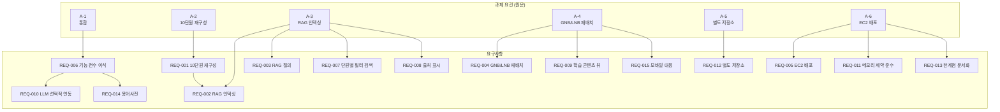

# 요구사항정의서

> - **버전**: v0.1
> - **최종 수정**: 2026-09-22 (KST)
> - **상태**: 초안
> - **기준 코드**: `main @ 1ba5a1c`
> - **역할**: 과제 요건(A-1~A-6)을 **검증 가능한 요구사항(REQ-###)** 으로 분해하고, 인수 기준(AC-##)과 연결한다.
> - **관련**: [과제-상세-안내.md](../10-착수/과제-상세-안내.md) · [범위기술서](../10-착수/범위기술서.md) · [변경이력](../00-index/변경이력.md)

---

## 0. 한 장 요약

| 항목 | 내용 |
| --- | --- |
| 과제 요건 수 | **6개** (A-1~A-6, [과제-상세-안내.md 4절](../10-착수/과제-상세-안내.md)) |
| 요구사항 수 | **15개** (REQ-001~REQ-015) |
| 인수 기준 수 | **15개** (AC-01~AC-15) |
| 우선순위 분포 | 필수 12 · 권장 2 · 선택 1 |
| 범위 변경 | CN-006 에 의해 기존 REQ-001~005(용어사전 전제)를 **폐기하고 재정의** |

> ⚠️ **기존 범위기술서 2.1절의 REQ-001~005 는 "용어사전 1개" 전제였습니다.**
> 과제 상세 요건(A-1~A-6)에 의해 범위가 전면 변경되었으므로(CN-001),
> 이 문서에서 REQ-001~005 를 **새 정의로 대체**합니다.
> 기존 정의는 폐기 처리하며 ID 는 재사용하되 내용이 완전히 바뀌었음을 명시합니다.

---

## 1. 요건 → 요구사항 추적

과제 요건(A-#)이 어떤 요구사항(REQ-###)으로 내려오는지 한눈에 봅니다.



---

## 2. 요구사항 전수 정의

### REQ-001 — 10단원 재구성

| 항목 | 내용 |
| --- | --- |
| **ID** | REQ-001 |
| **분류** | 데이터 |
| **요구 내용** | 3주 학습 자료(IA docs 11파일 3,943줄 + DRL data/samples 23파일 1.2MB + frontend/days 4개 HTML + theory-data.js)를 **정확히 10개 단원으로 재구성**한다. 각 단원에 번호·제목·학습목표·포함 원천을 부여한다. |
| **근거** | 과제 요건 A-2 "3주 간의 학습을 모두 통합하여 10단원으로 재구성" ([과제-상세-안내.md 4절](../10-착수/과제-상세-안내.md)) |
| **검증 방법** | 단원 목록이 정확히 10개이고, 모든 원천 파일이 어느 단원에든 매핑되어 있음을 확인 |
| **대응 AC** | AC-01 |
| **우선순위** | **필수** |

---

### REQ-002 — RAG 인덱싱

| 항목 | 내용 |
| --- | --- |
| **ID** | REQ-002 |
| **분류** | 기능 |
| **요구 내용** | 10단원으로 재구성된 학습 내용을 RAG 파이프라인으로 인덱싱한다. 각 청크에 단원 메타데이터(`unit_no`, `unit_title`)를 부여한다. 기존 해시 임베딩(384차원, `app/services/embedder.py:26-46`)과 RRF 하이브리드 검색(`app/services/hybrid_search.py:118-152`)을 활용한다. |
| **근거** | 과제 요건 A-3 "해당 학습 내용을 RAG로 인덱싱하여 본인만의 금융 상식 시스템으로 개편" |
| **현재 상태** | `app/models/document_chunk.py:13-20` 에 `unit_no`·`unit_title` 컬럼 없음. `app/ops/ingest_data_root.py:36` 은 `/app/data/DATA-ROOT` 경로만 적재 |
| **필요 변경** | (1) `document_chunk` 모델에 `unit_no`(Integer)·`unit_title`(String) 컬럼 추가 (2) `init.sql` 또는 마이그레이션으로 스키마 적용 (3) `ingest_data_root.py` 가 10단원 매핑에 따라 메타데이터를 부여하도록 수정 |
| **검증 방법** | `SELECT DISTINCT unit_no, unit_title FROM document_chunks` 가 정확히 10행 반환 |
| **대응 AC** | AC-02, AC-03 |
| **우선순위** | **필수** |

---

### REQ-003 — RAG 질의 (금융 상식 시스템)

| 항목 | 내용 |
| --- | --- |
| **ID** | REQ-003 |
| **분류** | 기능 |
| **요구 내용** | 사용자가 자연어 질문을 입력하면 인덱싱된 학습 내용에서 관련 청크를 검색해 답변한다. LLM 키가 있으면 생성형 답변, 없으면 검색 결과 원문을 그대로 보여준다. |
| **근거** | 과제 요건 A-3 "금융 상식 시스템으로 개편" |
| **현재 상태** | `app/api/routes/chat.py`(87줄) → `app/services/orchestrator.py`(171줄) → `app/services/rag_service.py`(203줄) 경로가 이미 동작. `app/services/llm_service.py:112-121` httpx 호출 |
| **검증 방법** | "PER이란 무엇인가?" 질의에 관련 청크가 1건 이상 반환 |
| **대응 AC** | AC-04 |
| **우선순위** | **필수** |

---

### REQ-004 — GNB/LNB 구조로 재배치

| 항목 | 내용 |
| --- | --- |
| **ID** | REQ-004 |
| **분류** | 화면 |
| **요구 내용** | 두 사이트의 모든 기능을 **GNB(상단 전역 내비게이션) + LNB(좌측 지역 내비게이션)** 2단 구조로 재배치한다. DRL 현재 메뉴 7개(`frontend/index.html:80-86`: 홈·종목보기·RAG 질문·시뮬레이션·베이시스·LEAN 백테스트·캘린더)와 IA 사이드바 33개(`sidebar-nav.html:4-101`)를 통합한다. |
| **근거** | 과제 요건 A-4 "두 사이트의 각종 기능을 재배치하고 GNB/LNB 구조로 재구성" |
| **현재 상태** | DRL 은 상단 버튼 내비 + 좌측 사이드바(이론학습·RAG 자료등록). IA 는 좌측 접기/펼치기 사이드바 단층 |
| **필요 변경** | (1) `frontend/index.html` 상단에 GNB 5~7개 항목 (2) 각 GNB 항목에 대응하는 LNB 좌측 패널 (3) `frontend/app.js:734-754` 의 `setView()` 함수를 GNB/LNB 라우팅으로 확장 |
| **검증 방법** | 모든 GNB 항목 클릭 시 대응하는 LNB 가 표시되고, 모든 LNB 항목이 해당 화면을 렌더링 |
| **대응 AC** | AC-05 |
| **우선순위** | **필수** |

---

### REQ-005 — AWS EC2 프리티어 배포

| 항목 | 내용 |
| --- | --- |
| **ID** | REQ-005 |
| **분류** | 배포 |
| **요구 내용** | 통합된 웹앱을 AWS EC2 프리티어(t2/t3.micro, 1 GiB RAM)에 배포하고, `http://<EIP>` 로 외부 접속 가능하게 한다. 이틀(9/22~9/23) 동안 유지한다. |
| **근거** | 과제 요건 A-6 "AWS EC2 서버 배포" + 구두 "프리티어로 진행" |
| **현재 상태** | `Dockerfile`(904B), `docker-compose.prod.yml`(2,754B), `SETUP_PLACEHOLDERS.md`(6,692B) 존재. `.github/workflows/cd.yml`·`cd-ecr.yml` 존재 |
| **검증 방법** | 외부 네트워크 브라우저에서 `http://<EIP>/` 접속 성공 (HTTP 200) |
| **대응 AC** | AC-06, AC-07 |
| **우선순위** | **필수** |

---

### REQ-006 — 기능 전수 이식

| 항목 | 내용 |
| --- | --- |
| **ID** | REQ-006 |
| **분류** | 기능 |
| **요구 내용** | 두 사이트의 기능을 프리티어 제약에 맞게 전부 이식한다. 프리티어에서 돌 수 있는 기능은 `port`(그대로 이식), 무거운 기능은 `lite`(화면은 살리되 서버 연산을 사전계산·클라이언트 연산으로 대체), 불가능한 기능은 `drop`(한계점으로 명시). **IA 33개 메뉴 + DRL 7개 메뉴 전부에 판정을 붙인다.** |
| **근거** | 과제 요건 A-1 "통합" + 구두 "기능 구현은 전부 다 되어야 됨" + [과제-상세-안내.md 5절 #3~#4](../10-착수/과제-상세-안내.md) 해석 |
| **필요 변경** | (1) IA 기능 중 클라이언트 전용(학습·퀴즈 등)은 `port` (2) yfinance·pykrx 의존 기능은 `lite`(사전계산 or 클라이언트) (3) torch·diffusers·cv2·Ollama·Meilisearch·MongoDB 의존 기능은 `drop` + 한계점 명시 |
| **검증 방법** | GNB/LNB 의 모든 메뉴를 클릭했을 때 깨지는 화면이 0건 |
| **대응 AC** | AC-08 |
| **우선순위** | **필수** |

---

### REQ-007 — 단원별 필터 검색

| 항목 | 내용 |
| --- | --- |
| **ID** | REQ-007 |
| **분류** | 기능 |
| **요구 내용** | RAG 질의 시 특정 단원 안에서만 검색하는 필터를 지원한다. "3단원 안에서만 찾기" 같은 요청을 처리한다. |
| **근거** | REQ-001(10단원)과 REQ-002(RAG 인덱싱)의 논리적 결합. 단원 메타데이터를 넣었으면 필터가 가능해야 의미가 있음 |
| **현재 상태** | `app/services/hybrid_search.py:68-116` 키워드 검색의 WHERE 절에 단원 조건 없음 |
| **필요 변경** | `hybrid_search.py` 의 벡터·키워드 양쪽 검색에 `unit_no` 필터 파라미터 추가 |
| **검증 방법** | `unit_no=3` 으로 질의하면 반환 청크의 `unit_no` 가 전부 3 |
| **대응 AC** | AC-09 |
| **우선순위** | **권장** |

---

### REQ-008 — 출처 표시

| 항목 | 내용 |
| --- | --- |
| **ID** | REQ-008 |
| **분류** | 기능 |
| **요구 내용** | RAG 답변에 "N단원 · 원천 파일명" 출처를 함께 표시한다. |
| **근거** | [작성 규칙 2.1절](../README.md) "근거 없는 문장을 쓰지 않는다". RAG 답변에도 같은 원칙 적용 |
| **현재 상태** | `app/schemas/chat.py` 의 응답 스키마에 출처 필드 없음 |
| **필요 변경** | 응답 스키마에 `sources` 배열 추가. 각 원소에 `unit_no`·`unit_title`·`document_id`·`chunk_index` |
| **검증 방법** | RAG 답변 JSON 에 `sources` 배열이 비어 있지 않음 |
| **대응 AC** | AC-10 |
| **우선순위** | **권장** |

---

### REQ-009 — 학습 콘텐츠 뷰

| 항목 | 내용 |
| --- | --- |
| **ID** | REQ-009 |
| **분류** | 화면 |
| **요구 내용** | 10단원 학습 콘텐츠를 탐색하는 화면을 제공한다. 단원 목록 → 단원 내 절 목록 → 본문 뷰 3단 구조. 기존 IA 학습 뷰(`learn-03`~`learn-11`, `sidebar-nav.html:14-32`)와 DRL 4일 이론학습(`frontend/days/01~04.html`)을 통합한다. |
| **근거** | 과제 요건 A-2 + A-4 의 결합. 10단원이 있으면 그것을 탐색하는 화면이 있어야 한다 |
| **검증 방법** | 각 단원을 선택하면 해당 학습 내용이 렌더링 |
| **대응 AC** | AC-05 (GNB/LNB 의 일부) |
| **우선순위** | **필수** |

---

### REQ-010 — LLM 선택적 연동

| 항목 | 내용 |
| --- | --- |
| **ID** | REQ-010 |
| **분류** | 비기능 |
| **요구 내용** | `.env` 에 LLM API 키가 없어도 검색·학습 콘텐츠·모든 화면이 동작한다. 키가 있으면 생성형 답변이 활성화된다. |
| **근거** | [과업지시서 2.3절 G4](../10-착수/과업지시서.md) "LLM 키가 없어도 G1~G3 전부 동작" |
| **현재 상태** | `app/services/llm_service.py` 가 키 없을 때 `(확인 필요 — 실제 동작 확인 필요)` |
| **검증 방법** | `.env` 에서 LLM 키를 제거한 상태로 전체 기능 테스트 |
| **대응 AC** | AC-11 |
| **우선순위** | **필수** |

---

### REQ-011 — 메모리 제약 준수

| 항목 | 내용 |
| --- | --- |
| **ID** | REQ-011 |
| **분류** | 비기능 |
| **요구 내용** | 프리티어 1 GiB RAM 안에서 모든 컨테이너의 RSS 합계가 안정적으로 동작한다. 불필요 서비스(redis·streamlit·Qdrant·Meilisearch·MongoDB·Ollama)를 제거하고, PostgreSQL + pgvector + API 최소 구성으로 운영한다. |
| **근거** | 과제 요건 A-6 "프리티어" + [과업지시서 7.2절](../10-착수/과업지시서.md) "1 GiB RAM" |
| **현재 상태** | DRL `docker-compose.yml` 에 5개 서비스(postgres·redis·qdrant·api·streamlit). IA `docker-compose.yml` 에 9개 서비스 |
| **필요 변경** | (1) redis 제거 — `import redis` 0건 (`app/` 전체) (2) streamlit 제거 — 프론트와 중복 (3) Qdrant → pgvector 전환 (벡터 저장) (4) Meilisearch·MongoDB·Ollama 미이식 |
| **검증 방법** | `docker stats --no-stream` 에서 RSS 합계가 800MB 이하 `(확인 필요 — 실측으로 확정)` |
| **대응 AC** | AC-12 |
| **우선순위** | **필수** |

---

### REQ-012 — 별도 저장소

| 항목 | 내용 |
| --- | --- |
| **ID** | REQ-012 |
| **분류** | 형상 |
| **요구 내용** | 작업은 기존 `domain-rag-lab`·`investment-analysis` 와 별도인 `investment-rag-lab` 저장소에서 수행한다. |
| **근거** | 과제 요건 A-5 "레포지토리는 무조건 별도로 파서 하기" |
| **현재 상태** | ✅ 완료. GitHub: `EST-Bootcamp-Dongwon/investment-rag-lab`, GitLab: `mygithub05253/investment-rag-lab`. 기준 코드 `main @ 1ba5a1c` |
| **검증 방법** | `git remote -v` 로 원격 확인 |
| **대응 AC** | — (완료됨) |
| **우선순위** | **필수** |

---

### REQ-013 — 프리티어 한계점 문서화

| 항목 | 내용 |
| --- | --- |
| **ID** | REQ-013 |
| **분류** | 배포 |
| **요구 내용** | 프리티어로 인한 한계점을 명시한 문서를 작성한다. 각 항목에 "무엇이 안 되는가 · 왜(프리티어 어느 제약) · 대신 무엇을 했는가" 3요소를 갖춘다. |
| **근거** | 과제 요건 A-6 "프리티어로 인한 한계점을 명시해주면 됨" |
| **검증 방법** | `95-배포운영/한계점.md` 에 3요소를 갖춘 항목이 3건 이상 |
| **대응 AC** | AC-13 |
| **우선순위** | **필수** |

---

### REQ-014 — 용어사전 기능

| 항목 | 내용 |
| --- | --- |
| **ID** | REQ-014 |
| **분류** | 기능 |
| **요구 내용** | IA 의 용어집(`voca.md` 268줄)과 DRL 의 `finance_glossary.txt`(1,547줄)을 통합한 용어사전 조회·검색 기능을 제공한다. 기존 DRL 의 용어사전 설계(범위기술서 2.1절)를 승계하되, 10단원 학습 콘텐츠와 연동한다. |
| **근거** | 기존 범위기술서 REQ-001~003 승계 + 과제 요건 A-1 "통합" |
| **검증 방법** | 용어 검색에 결과가 1건 이상 반환 |
| **대응 AC** | AC-14 |
| **우선순위** | **필수** |

---

### REQ-015 — 모바일 대응

| 항목 | 내용 |
| --- | --- |
| **ID** | REQ-015 |
| **분류** | 화면 |
| **요구 내용** | GNB/LNB 구조가 좁은 화면(모바일)에서 햄버거 메뉴로 접히고, 콘텐츠 영역이 전폭으로 확장된다. |
| **근거** | 과제 요건 A-4 "GNB/LNB 구조로 재구성" — 현대 웹앱의 기본 요건. 채점이 모바일에서 이뤄질 가능성 |
| **검증 방법** | 브라우저 DevTools 에서 375px 너비로 확인 |
| **대응 AC** | AC-15 |
| **우선순위** | **선택** |

---

## 3. 인수 기준 (AC)

> 기존 범위기술서 AC-01~AC-10 은 "용어사전 1개" 전제였으므로, 여기서 **재정의**합니다.
> 기존 AC 와 ID 가 겹치지만 내용이 다릅니다 — CN-006 에 의한 변경입니다.

| AC | 기준 | 검증 방법 | 대응 REQ |
| --- | --- | --- | --- |
| AC-01 | 10단원 매핑 문서에 정확히 10개 단원이 있고, 모든 원천 파일이 매핑되어 있다 | 매핑 문서 검토 | REQ-001 |
| AC-02 | `document_chunks` 테이블에 `unit_no` 1~10 이 모두 존재한다 | `SELECT DISTINCT unit_no FROM document_chunks ORDER BY unit_no` | REQ-002 |
| AC-03 | 인덱싱된 청크 수가 코퍼스 총 바이트 ÷ 500 의 ±20% 이내 | 청크수 실측 vs 추정치 비교 | REQ-002 |
| AC-04 | "PER이란?" 질의에 관련 청크가 1건 이상, 출처(unit_no·document_id) 포함 | `curl POST /api/chat` | REQ-003 |
| AC-05 | 상단에 GNB 5~7개 항목이 표시되고, 각 항목 클릭 시 LNB 가 전환된다 | 브라우저 수동 확인 | REQ-004, REQ-009 |
| AC-06 | 외부 네트워크에서 `http://<EIP>/` 가 HTTP 200 을 반환한다 | 다른 네트워크 브라우저 + `curl -I` | REQ-005 |
| AC-07 | 배포 서버에서 2일간 서비스 중단 없이 동작한다 | 9/23 말 기준 확인 | REQ-005 |
| AC-08 | GNB/LNB 의 모든 메뉴 항목을 클릭했을 때 빈 화면·에러 페이지가 0건이다 | 전 메뉴 수동 클릭 테스트 | REQ-006 |
| AC-09 | `unit_no=3` 필터 질의 시 반환 청크의 `unit_no` 가 전부 3이다 | API 호출 검증 | REQ-007 |
| AC-10 | RAG 답변 JSON 에 `sources` 배열이 비어 있지 않다 | API 응답 검사 | REQ-008 |
| AC-11 | `.env` 에서 LLM 키를 제거해도 AC-01~AC-10 이 전부 통과한다 | 키 제거 후 전체 재실행 | REQ-010 |
| AC-12 | `docker stats --no-stream` RSS 합계가 800MB 이하 | EC2 에서 실측 `(상한은 자원 산정에서 확정)` | REQ-011 |
| AC-13 | `95-배포운영/한계점.md` 에 3요소(무엇·왜·대신)를 갖춘 항목이 3건 이상 | 문서 검토 | REQ-013 |
| AC-14 | 용어 검색에 결과가 1건 이상 반환된다 | 브라우저에서 검색 수행 | REQ-014 |
| AC-15 | 375px 너비에서 GNB 가 햄버거 메뉴로 접힌다 | DevTools 모바일 뷰 | REQ-015 |

---

## 4. 자원 추정 (REQ-002 근거)

RAG 인덱싱의 규모를 사전 추정합니다.

### 4.1 코퍼스 총량

| 원천 | 파일 수 | 총 바이트 | 출처 |
| --- | --- | --- | --- |
| `data/samples/*.txt` | 23 | 1,246,930 | DRL 자산 조사 (2026-09-22 서브에이전트 실측) |
| IA `docs/*.md` | 11 | ~290,000 | 학습 코퍼스 조사 (2026-09-22 서브에이전트 실측, 3,943줄) |
| `frontend/days/01~04.html` | 4 | ~570,000 | `(확인 필요 — HTML 에서 텍스트만 추출 시 감소)` |
| `frontend/assets/theory-data.js` | 1 | ~135,000 | 학습 코퍼스 조사 실측 229줄 |
| **합계** | **39** | **~2.2MB** | |

### 4.2 청크 수 추정

```
텍스트만 추출 후 추정 총량: ~1.5MB (HTML 태그 제거)
chunk_size = 500 글자 (config.py:29)
chunk_overlap = 80 글자 (config.py:30)
유효 진행폭 = 500 - 80 = 420 글자
한국어 1글자 ≈ 3바이트 (UTF-8)
청크 수 ≈ 1,500,000 / 3 / 420 ≈ 1,190 청크
```

### 4.3 벡터 용량 추정

```
embedding_dim = 384 (config.py:22)
float32 = 4 bytes
벡터 용량 = 1,190 × 384 × 4 = 1,827,840 bytes ≈ 1.7 MB
```

**pgvector 만으로 충분합니다.** Qdrant 를 별도로 띄울 이유가 없는 규모입니다.

---

## 5. 우선순위 분류

| 우선순위 | 요구사항 | 수 |
| --- | --- | --- |
| **필수** | REQ-001, 002, 003, 004, 005, 006, 009, 010, 011, 012, 013, 014 | 12 |
| **권장** | REQ-007, 008 | 2 |
| **선택** | REQ-015 | 1 |

필수 12건이 이틀 일정에서 전부 완료되어야 합니다.

---

## 6. 용어 정의

| 용어 | 뜻 |
| --- | --- |
| GNB | Global Navigation Bar — 상단 전역 내비게이션 |
| LNB | Local Navigation Bar — 선택된 GNB 항목에 종속되는 좌측 지역 내비게이션 |
| port | 프리티어에서 그대로 이식 가능한 기능 |
| lite | 화면은 살리되 서버 연산을 사전계산·클라이언트 연산으로 대체한 기능 |
| drop | 프리티어에서 물리적으로 불가하여 제외하고 한계점으로 명시하는 기능 |
| RRF | Reciprocal Rank Fusion — 벡터 검색과 키워드 검색의 순위를 병합하는 방식 |
