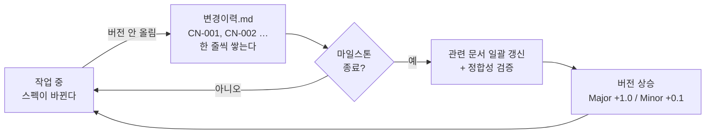

# domain-rag-lab 산출물 문서

> 이 폴더는 **커밋·공개되는 프로젝트 산출물**입니다.
> 개인 메모가 아니라, 그대로 심사·리뷰에 제출할 수 있는 정본입니다.

- **문서 버전**: **v0.1** (2026-09-21 착수)
- **기준 코드**: `main` 브랜치, 커밋 `a13b9a8` — **전 문서 공통**
- **작성 언어**: 한국어. 식별자·API 경로만 영문.
- **상태**: `10-착수` 작성 완료 (2종). 나머지 폴더는 미착수.

---

## 1. 이 문서를 읽는 순서

폴더 번호는 **SI 산출물 10개 구분**을 따릅니다. 위에서부터 읽으면 됩니다.

| # | 구분 | 폴더 | 무엇이 있나 |
| --- | --- | --- | --- |
| — | 색인 | `00-index/` | 전체 지도 · 산출물 대장 · 요구사항 대조표 · 변경이력 |
| 1 | 착수·과업 정의 | [`10-착수/`](10-착수/) | 과업지시서 · 범위기술서 |
| 2 | 요구사항 관리 | `20-요구사항/` | 요구사항정의서 · 요구사항 추적표(RTM) |
| 3 | 일정·업무 관리 | `30-일정/` | WBS · 세션 로드맵 · 이슈·리스크 대장 |
| 4 | 화면·서비스 설계 | `40-화면/` | IA·화면목록 · 화면 상세 · 용어 모달 사양 |
| 5 | 데이터 설계 | `50-데이터/` | 용어 데이터모델 · ERD · ETL 파싱규칙 · 연관그래프 산출규칙 · 원천자료 대장 |
| 6 | 시스템 설계 | `60-시스템/` | 아키텍처 · 컴포넌트 구성 · 자원 산정 |
| 7 | 인터페이스 설계 | `70-인터페이스/` | API 목록 · API 상세명세 · 공통 응답과 에러 · LLM 연동 인터페이스 |
| 8 | 개발·형상 관리 | `80-개발형상/` | 개발표준 · 형상관리 규약 · CI 파이프라인 · 환경변수 대장 |
| 9 | 시험·성과 검증 | `90-시험/` | 시험계획서 · 시험시나리오 결과서 · 성능 측정결과 |
| 10 | 배포·운영·인수 | `95-배포운영/` | 배포계획서 · 운영 런북 · 인수인계서 · 점검 체크리스트 |
| — | 결정 기록 | `decisions/` | ADR — `NNNN-한국어-제목.md` |

> ⚠️ **이 저장소의 폴더 번호는 SI 산출물 10개 구분을 가리킵니다.**
> 같은 모노레포의 `projects/investment-dashboard/docs/spec/` 도 `NN-분류` 형식을 쓰지만
> **번호의 뜻이 다릅니다**(거기서 `30-` 은 데이터, 여기서 `30-` 은 일정). 섞어 읽지 마십시오.

**빠르게 훑고 싶다면** → `00-index/마스터인덱스.md` (S02 에서 생성)
**무엇을 만들고 무엇을 안 만드는지** → [`10-착수/범위기술서.md`](10-착수/범위기술서.md)

### 1.1 폴더 구조

```text
docs/
├── README.md              ← 이 문서. 작성 규칙 정본
├── 00-index/              색인 — 마스터인덱스 · 산출물 대장 · 변경이력
├── 10-착수/               ✅ 과업지시서 · 범위기술서
├── 20-요구사항/           요구사항정의서 · 요구사항 추적표(RTM)
├── 30-일정/               WBS · 세션 로드맵 · 이슈·리스크 대장
├── 40-화면/               IA·화면목록 · 화면 상세 · 용어 모달 사양
├── 50-데이터/             용어 데이터모델 · ERD · ETL 파싱규칙 · 연관그래프 산출규칙
├── 60-시스템/             아키텍처 · 컴포넌트 구성 · 자원 산정
├── 70-인터페이스/         API 목록 · API 상세명세 · 공통 응답과 에러 · LLM 연동
├── 80-개발형상/           개발표준 · 형상관리 규약 · CI 파이프라인 · 환경변수 대장
├── 90-시험/               시험계획서 · 시험시나리오 결과서 · 성능 측정결과
├── 95-배포운영/           배포계획서 · 운영 런북 · 인수인계서 · 점검 체크리스트
└── decisions/             ADR — NNNN-한국어-제목.md
```

✅ 는 작성 완료를 뜻합니다. 진행 현황은 `00-index/산출물-대장.md` 에서 관리합니다.

---

## 2. 문서를 쓰는 규칙

### 2.1 근거 없는 문장을 쓰지 않는다

명세에 적는 숫자·동작·제약은 아래 셋 중 하나여야 합니다.

1. **코드에서 확인** — 파일과 줄 번호를 함께 적는다. 예: `app/services/hybrid_search.py:118`
2. **실측** — 명령과 측정일을 함께 적는다. 예: `wc -l` 기준 2026-09-21
3. **공식 문서** — URL 과 확인일을 함께 적는다.

셋 다 아니면 **`(확인 필요)`** 를 붙입니다. 추측을 사실처럼 적지 않습니다.

> 이 규칙은 **데이터에도 적용**합니다. 용어 레코드는 원문 줄 번호(`source_line`)를,
> 연관 간선은 생성 근거(`evidence`)를 함께 저장합니다. 화면에서 출처를 그대로 보여줄 수 있어야 합니다.

### 2.2 버전은 작업 중에 올리지 않는다

이게 이 폴더의 가장 중요한 운영 규칙입니다.

- **작업 중에는 버전을 올리지 않습니다.** 스펙이 바뀌면 `00-index/변경이력.md` 의
  **"미반영 변경노트"** 절에 `CN-###` 한 줄로 쌓아둡니다.
- **마일스톤이 끝나면 그때 한 번에** 올립니다. 이때 관련 문서를 동시에 갱신하고
  요구사항 ↔ ERD ↔ API ↔ 화면의 정합성을 함께 검증합니다.
- 올리는 폭:
  - **Major (+1.0)** — 아키텍처·데이터 모델이 바뀐다. 기존 문서를 다시 읽어야 한다.
  - **Minor (+0.1)** — 기능·엔드포인트가 늘거나 준다. 읽던 사람은 델타만 보면 된다.
  - **오탈자·서식** — 버전을 올리지 않는다.

마일스톤은 두 개입니다 — **M1**(코드 대청소 완료 · 기준 sha 고정) · **M2**(기능 완성).
최종 `v1.0` 은 전체 정합성 검증 후 확정합니다.

흐름으로 보면 이렇습니다.



**왜 이렇게 하는가** — 작업할 때마다 버전을 올리면 `v0.2` 가 하루에 다섯 번 생기고,
**"지금 어느 버전이 정본인지" 를 아무도 모르게 됩니다.** 변경은 CN 으로 쌓아 두고
마일스톤에서 한 번에 정리하면, 버전 번호가 실제로 의미를 갖습니다.

### 2.3 문서마다 머리말을 단다

```markdown
> - **버전**: v0.1
> - **최종 수정**: 2026-09-21 (KST)
> - **상태**: 초안 | 검토중 | 확정
> - **기준 코드**: `main @ a13b9a8`
> - **역할**: <이 문서가 무엇을 확정하는가 한 문장>
> - **관련**: [범위기술서](범위기술서.md)
```

### 2.4 링크는 상대 경로로 건다

GitHub 웹에서도 로컬 편집기에서도 따라갈 수 있어야 합니다.

---

## 3. ID 체계

ID 는 **절대 재사용하지 않습니다.** 대상이 폐기돼도 번호는 회수하지 않고 `폐기` 상태로 남깁니다.

| 접두 | 대상 | 대장 |
| --- | --- | --- |
| `REQ-###` | 요구사항 | `20-요구사항/요구사항정의서.md` |
| `CN-###` | 변경노트 (미반영 스펙 변경) | `00-index/변경이력.md` |
| `R-##` | 위험 | `30-일정/이슈-리스크대장.md` |
| `AC-##` | 인수 기준 | [`10-착수/범위기술서.md`](10-착수/범위기술서.md) |
| `TC-###` | 시험 케이스 | `90-시험/시험시나리오-결과서.md` |
| `Q-##` | 미해결 질문 | [`10-착수/범위기술서.md`](10-착수/범위기술서.md) |
| `NNNN` | ADR | `decisions/NNNN-한국어-제목.md` |

**기능 ID(`F##`)는 쓰지 않습니다** — 이 프로젝트의 목표 기능은 하나뿐이라 번호 공간이 필요 없습니다.

---

## 4. 폴더와 파일 이름 규칙

- 폴더: `NN-분류` (두 자리 숫자 + 한국어). 정렬 순서가 곧 읽는 순서.
- 파일: 한국어 명사구, 공백 대신 하이픈. 예: `요구사항-추적표.md`
- 문서는 도메인 단위로 묶습니다. 항목 1개당 파일 1개로 쪼개지 않습니다.

---

## 5. 이 폴더가 RAG 색인에 들어가지 않는 이유

이 저장소의 지식 베이스는 `data/samples/` 의 금융 학습 자료입니다.
`docs/` 는 **의도적으로 색인하지 않습니다** — 산출물 문서와 학습 자료가 섞이면
용어사전 답변의 출처가 흐려지기 때문입니다.

색인 대상을 바꾸려면 적재 경로(`app/ops/`)를 고쳐야 하며, 그 결정은 ADR 로 남깁니다.
